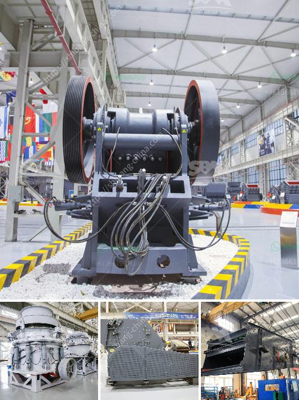

<h3>fly ash processing plant</h3>
Fly ash is a waste product generated during the combustion process of coal in power stations. It is composed of fine particles that are carried away by flue gases during combustion, and when cooled, these particles settle as ash. However, with advancements in technology, fly ash has found various applications, leading to the establishment of fly ash processing plants.

A fly ash processing plant is a facility where fly ash is transformed into useful materials for various industries. The process involves treating fly ash with additives to improve its properties and enhance its potential applications. This plant is crucial as it helps in reducing the environmental impact of fly ash by diverting it from landfills where it could pose a risk to the ecosystem.

The first step in the fly ash processing plant is the collection and transportation of fly ash from power stations to the plant. Once at the plant, the fly ash undergoes a series of processes, including grinding, drying, and classification. These processes help to reduce the particle size of the fly ash, remove moisture, and separate it into different grades based on its quality.

The processed fly ash can be used in various industries, including construction, agriculture, and manufacturing. In the construction industry, fly ash is commonly used as a partial replacement for cement in concrete production. This not only reduces the demand for cement but also improves the strength and durability of the concrete. In agriculture, fly ash can be used as a soil amendment to improve fertility and reduce acidity in the soil. Furthermore, it can be used in the manufacturing of bricks, ceramics, and various other composites.

Fly ash processing plants play a vital role in promoting sustainable practices by converting a waste product into valuable resources. They contribute to the circular economy by reducing waste generation, conserving natural resources, and minimizing environmental pollution. Moreover, these plants create job opportunities and stimulate economic growth in the regions where they are established.

In conclusion, fly ash processing plants are crucial for the efficient utilization of fly ash generated from coal combustion. They help to transform this waste material into valuable resources with various applications across different industries. The establishment of these plants promotes sustainable practices, conserves resources, and contributes to economic growth.
<h3>Contact us</h3><ul><li><strong>Whatsapp:&nbsp;<a href="https://wa.me/8613661969651">+8613661969651</a></strong></li><li><a href="https://swt.shibang-china.com/?git&amp;zhl&amp;fly ash processing plant"><strong>Online Service(chat now)</strong></a></li></ul><h3>Related</h3><ul><li><a href='rollers for stone ball mills.md'>rollers for stone ball mills</a></li><li><a href='concrete crusher for sale used in canada.md'>concrete crusher for sale used in canada</a></li><li><a href='aggregates crushing flow chart process.md'>aggregates crushing flow chart process</a></li><li><a href='feasibility study for coal mining.md'>feasibility study for coal mining</a></li><li><a href='crusher prices in kenya.md'>crusher prices in kenya</a></li></ul>