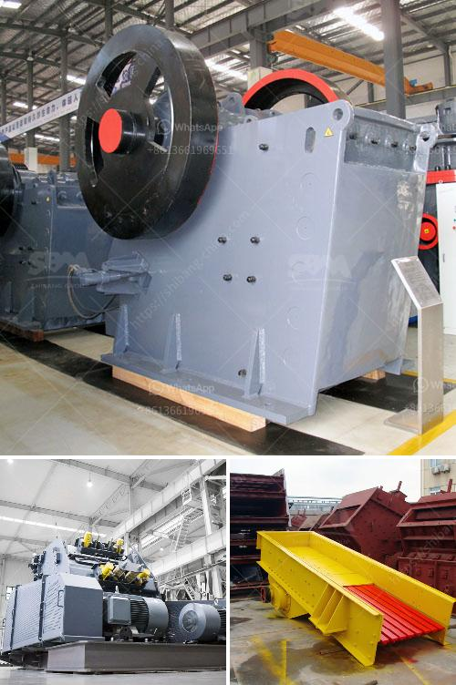

<h3>frac sand mine feasibility study</h3>
Frac sand mining has gained significant attention in recent years due to its essential role in hydraulic fracturing, also known as fracking. Utilized in oil and gas extraction, frac sand is a specialized sand that is crucial for the proper functioning of the fracking process. However, before embarking on a frac sand mining operation, a thorough feasibility study must be conducted to assess its viability, environmental impact, and overall economic benefits. This article aims to shed light on the key aspects of a frac sand mine feasibility study.

One of the primary considerations when evaluating the feasibility of a frac sand mine is understanding and mitigating potential environmental impacts. Such impacts may include groundwater contamination, air pollution, habitat destruction, and noise pollution. A comprehensive environmental assessment should incorporate rigorous monitoring and risk management plans to ensure regulatory compliance and environmental protection.

Additionally, addressing concerns related to water usage should be a priority as frac sand mines require substantial water resources for the mining and processing activities. Local water sources should be thoroughly evaluated to determine if they can sustain the proposed operation without adversely impacting nearby communities or ecosystems.

Assessing the market demand for frac sand is crucial for determining the financial feasibility of a mining operation. Market research should include analyzing the current and projected demand for frac sand in the targeted regions and potential customers. Key factors to consider may include the availability and proximity of alternative frac sand sources, transportation logistics, and pricing dynamics.

Furthermore, evaluating the potential economic benefits of the project is essential. Examining costs associated with land acquisition, infrastructure development, equipment investment, labor, and transportation expenses can help determine the viability of the operation. Economic considerations should also include analyzing potential revenue streams, such as sand sales, royalties, and potential partnerships with oil and gas companies.

A frac sand mine can significantly impact nearby communities and local economies. A thorough feasibility study should assess the social and demographic effects of a potential mining operation, including evaluating the potential benefits and drawbacks for the community. Key factors to consider may include employment opportunities, tax revenues, infrastructure development, and potential social conflicts.

Engaging with stakeholders, including local communities, environmental groups, and regulators, is crucial to understanding their concerns and addressing any potential opposition that may arise during and after the feasibility study. Public consultations and open forums can help ensure transparency and build trust between the mining company and the community.

Conducting a comprehensive feasibility study is crucial when considering a frac sand mining project. This study should evaluate environmental impacts, regulatory compliance, market demand, economic viability, and community impacts. Taking a holistic approach ensures that all important aspects are considered, allowing for informed decision-making and responsible mining practices.
<h3>Contact us</h3><ul><li><strong>Whatsapp:&nbsp;<a href="https://wa.me/8613661969651">+8613661969651</a></strong></li><li><a href="https://swt.shibang-china.com/?git&amp;zhl&amp;frac sand mine feasibility study"><strong>Online Service(chat now)</strong></a></li></ul><h3>Related</h3><ul><li><a href='project report of dolomite powder plant.md'>project report of dolomite powder plant</a></li><li><a href='dolomite processing plant.md'>dolomite processing plant</a></li><li><a href='coconut shell powder mill machinery maker in sri lanka.md'>coconut shell powder mill machinery maker in sri lanka</a></li><li><a href='screen and crusher hire.md'>screen and crusher hire</a></li><li><a href='crusher plant quarry philippines.md'>crusher plant quarry philippines</a></li></ul>