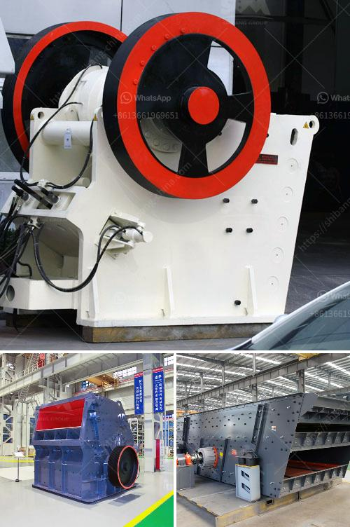

<h3>friendly gold mining equipment</h3>
Gold mining has long been associated with adverse environmental impacts, such as deforestation, soil erosion, and water pollution. However, with advancements in technology, the industry is now embracing more eco-friendly practices, including the use of environmentally friendly gold mining equipment. This equipment prioritizes sustainability, protecting both the environment and local communities.

One crucial aspect of eco-friendly gold mining equipment is the reduction in harmful emissions. Traditional mining equipment, such as diesel-powered machinery, can release high levels of greenhouse gases and other pollutants into the atmosphere. In contrast, modern equipment utilizes advanced technologies like electric power systems and hybrid engines, significantly reducing emissions and helping combat climate change.

Another key focus is minimizing water pollution. Gold mining often involves the use of large amounts of water, which can be contaminated with toxic substances like mercury and cyanide. However, eco-friendly equipment includes innovative water treatment systems that purify and recycle water, minimizing its consumption and limiting pollution risks, thus protecting local ecosystems and water supplies.

Moreover, environmentally friendly equipment also aims to reduce deforestation by limiting land disturbance. Innovative methods, such as low-impact gold extraction techniques, strive to minimize the destruction of natural habitats. Additionally, reclamation efforts focus on rehabilitating the mined areas, allowing for vegetation regrowth and the restoration of biodiversity.

An essential element of eco-friendly gold mining equipment is social responsibility. Mining companies now prioritize the well-being and involvement of local communities, ensuring their safety and providing economic opportunities. This includes providing training, employment, and support for education and healthcare. By embracing responsible practices, the mining industry can contribute to sustainable development, improving the livelihoods of those living in mining areas.

Overall, eco-friendly gold mining equipment combines technological innovations with a commitment to safeguarding the environment and communities. By reducing emissions, preventing water pollution, minimizing deforestation, and prioritizing social responsibility, the mining industry is working towards sustainable practices. As demand for gold continues to grow, it becomes crucial for the industry to adopt and advocate for such eco-friendly measures, preserving our planet for future generations.
<h3>Contact us</h3><ul><li><strong>Whatsapp:&nbsp;<a href="https://wa.me/8613661969651">+8613661969651</a></strong></li><li><a href="https://swt.shibang-china.com/?git&amp;zhl&amp;friendly gold mining equipment"><strong>Online Service(chat now)</strong></a></li></ul><h3>Related</h3><ul><li><a href='china raymond roller mills.md'>china raymond roller mills</a></li><li><a href='lime crushing plant components.md'>lime crushing plant components</a></li><li><a href='small bleaching powder manufacturing plant project report.md'>small bleaching powder manufacturing plant project report</a></li><li><a href='used limestone milling machine.md'>used limestone milling machine</a></li><li><a href='business plan for stone crushing plant pdf.md'>business plan for stone crushing plant pdf</a></li></ul>