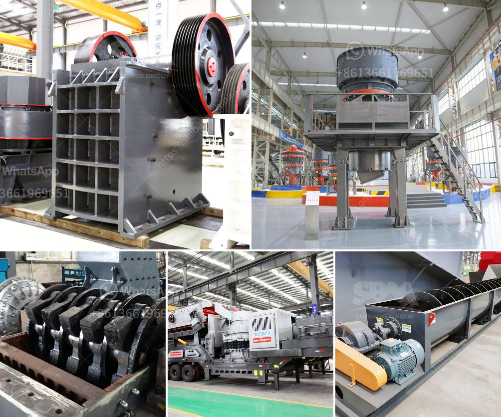

<h3>german grinding machine manufacturers</h3>
Grinding machines are indispensable tools in the manufacturing industry and are used for the intricate shaping and grinding of various metals and materials. The market for grinding machines is highly competitive, with many local and international manufacturers vying for market share. In Germany, a country renowned for its engineering expertise, grinding machines are prevalent.

The machines produced by German machine manufacturers are known for their excellent quality, reliability, and precision. Well-known manufacturers such as Blohm, Jung, Mägerle, and Schaudt produce grinding machines that are respected worldwide. These companies strive to develop machines that meet the diverse needs of their customers without compromising on precision or reliability.

The combination of strict engineering standards, advanced technology, and skilled craftsmanship has resulted in German grinding machines becoming highly sought after by manufacturers around the globe. These machines are used in various industries, including automotive, aerospace, tooling, medical, and energy. They can handle a wide range of materials, from metals to composites, ceramics, and even glass.

Innovation has been the driving force behind the success of German machine manufacturers. These companies continuously invest in research and development to improve their grinding machines and meet the evolving needs of their customers. They work closely with customers to understand their requirements and incorporate their feedback into the design and development process.

German grinding machine manufacturers have also embraced digitalization and Industry 4.0 concepts. They have integrated cutting-edge technologies such as artificial intelligence, machine learning, and automation into their machines. This allows manufacturers to optimize production, improve efficiency, and reduce downtime.

Furthermore, these companies offer comprehensive service and support packages, ensuring that their customers have access to technical advice, spare parts, and repairs. This focus on customer satisfaction has further strengthened the reputation of German grinding machine manufacturers in the global market.

Despite fierce competition in the global market, German grinding machine manufacturers have maintained their strong footing. They constantly adapt to changing market trends and customer demands, ensuring that their machines stay relevant and competitive.

Additionally, the German manufacturing industry benefits from a highly skilled workforce and a robust apprenticeship system. This ensures that manufacturers have a constant supply of well-trained engineers and technicians, capable of producing high-quality grinding machines.

In conclusion, German grinding machine manufacturers have a strong presence in the global market due to the high quality, innovation, and reliability of their products. These manufacturers continue to invest in research and development, integrating cutting-edge technologies to meet the evolving demands of the manufacturing industry. With their commitment to customer satisfaction and continuous improvement, German grinding machine manufacturers are likely to remain leaders in the market for years to come.
<h3>Contact us</h3><ul><li><strong>Whatsapp:&nbsp;<a href="https://wa.me/8613661969651">+8613661969651</a></strong></li><li><a href="https://swt.shibang-china.com/?git&amp;zhl&amp;german grinding machine manufacturers"><strong>Online Service(chat now)</strong></a></li></ul><h3>Related</h3><ul><li><a href='how to build a gold wash plant.md'>how to build a gold wash plant</a></li><li><a href='small gold mining plant in south africa.md'>small gold mining plant in south africa</a></li><li><a href='hammer mill for quartz rock.md'>hammer mill for quartz rock</a></li><li><a href='granite crushers for sale.md'>granite crushers for sale</a></li><li><a href='vertical ball mill nigeria.md'>vertical ball mill nigeria</a></li></ul>