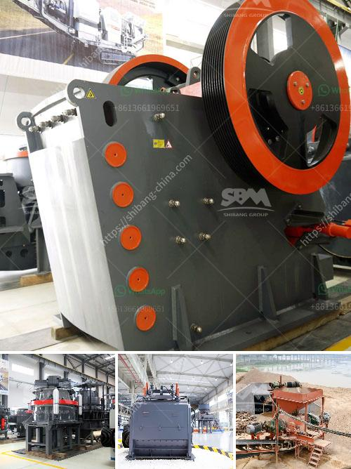

<h3>german hammer mill ceramic</h3>
Grinding technology has come a long way since its inception, evolving into a highly sophisticated process. One such innovation in grinding technology is the German hammer mill ceramic, known for its remarkable performance and durability. This article delves into the features and advantages of this unique ceramic milling equipment.

The German hammer mill ceramic is a specialized type of mill designed for grinding materials into fine powders. It is highly regarded for its ability to efficiently reduce particle size, making it a popular choice for various industries such as food processing, pharmaceuticals, and chemical manufacturing. 

What sets the German hammer mill ceramic apart from traditional mills is its exceptional wear resistance. The mill is lined with high-quality ceramic materials, meticulously engineered to withstand the high impact and stress of the grinding process. This not only ensures a longer lifespan but also minimizes the risk of cross-contamination, making it an ideal choice for applications that require strict quality control.

Another notable feature of the German hammer mill ceramic is its versatility. It is capable of handling a wide range of materials, including but not limited to minerals, ores, spices, herbs, and even some fibrous materials. This adaptability makes it a valuable tool for companies with diverse grinding needs, allowing them to streamline their processes and achieve consistent, high-quality results.

Efficiency is a key factor in any grinding operation, and the German hammer mill ceramic excels in this aspect. Its unique design allows for efficient particle size reduction, maximizing throughput while minimizing energy consumption. This not only results in significant cost savings but also contributes to environmental sustainability, an increasingly important consideration in today's industries.

Furthermore, the German hammer mill ceramic offers easy maintenance and cleaning. Its interior design allows for quick and hassle-free access to the grinding chamber, facilitating regular inspections and necessary upkeep. Additionally, the ceramic lining's non-stick properties make it relatively easy to clean, ensuring efficient operation and reducing downtime.

German engineering is renowned worldwide for its precision and attention to detail, and the German hammer mill ceramic is a testament to this reputation. Each mill is manufactured to the highest standards, incorporating advanced technologies and quality materials. This commitment to excellence ensures consistent performance, reliability, and customer satisfaction.

In conclusion, the German hammer mill ceramic represents an innovative milestone in grinding technology. Its exceptional wear resistance, versatility, efficiency, and ease of maintenance set it apart from conventional mills, making it an indispensable tool for various industries. Whether it is grinding minerals, pharmaceutical ingredients, or other materials, this impressive ceramic milling equipment guarantees exceptional results, time and time again. With its German engineering pedigree, the German hammer mill ceramic is a sound investment for businesses seeking a reliable and efficient grinding solution.
<h3>Contact us</h3><ul><li><strong>Whatsapp:&nbsp;<a href="https://wa.me/8613661969651">+8613661969651</a></strong></li><li><a href="https://swt.shibang-china.com/?git&amp;zhl&amp;german hammer mill ceramic"><strong>Online Service(chat now)</strong></a></li></ul><h3>Related</h3><ul><li><a href='distributor philippines test sieve retsch.md'>distributor philippines test sieve retsch</a></li><li><a href='crusher hpt cone crusher price.md'>crusher hpt cone crusher price</a></li><li><a href='sand making machine kenya.md'>sand making machine kenya</a></li><li><a href='100tpd mini cement plant project cost in india.md'>100tpd mini cement plant project cost in india</a></li><li><a href='rental companies of mobile crusher.md'>rental companies of mobile crusher</a></li></ul>