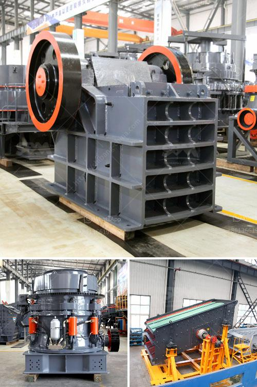

<h3>germany stone crusher machine factories</h3>
Germany stone crusher machine is mainly for various types of stone crushing operations, according to the different principles of broken and particle size, into many types, PE jaw crusher, PEW jaw crusher, PF impact crusher, PFW impact crusher, HPT hydraulic cone crusher, CS cone crusher, py spring cone crusher, and other eight series of dozens of specifications that are widely used in many departments of mines, metallurgy, building materials, highway, water conservancy, and chemical industry, etc.

In recent years, with the increasing demand for aggregate materials in construction industry, the market for crushers inevitably expands, which in return boosts the development of stone crusher machine industry. Germany stone crusher machine is mainly for various types of stone crushing operations, according to the different principles of broken and particle size, into many types, PE jaw crusher, PEW jaw crusher, PF impact crusher, PFW impact crusher, HPT hydraulic cone crusher, CS cone crusher, py spring cone crusher, and other eight series of dozens of specifications that are widely used in many departments of mines, metallurgy, building materials, highway, water conservancy, and chemical industry, etc.

According to the market demand and more TEMPthan 40 years of crusher experience, HXJQ has developed HD series high-performance fixed crushers, which are widely used in mine, metallurgy, construction, transportation, and building materials industry. HD German fixed jaw crusher used in cement industry (500TPD) In the mining and construction crushing industry, the quality and operation of fixed jaw crusher directly affect the complete production line, which makes the production capacity and stability of the fixed jaw crusher higher and higher. According to the market demand and more TEMPthan 40 years of crusher experience, HXJQ TEMPhas developed HD series high-performance fixed jaw crusher jointly by German crushers manufacturers. HD medium-size jaw crusher in Henan HXJQ Machinery is always standby, ready to answer your questions about fixed jaw crushers and quarry plants, HD German jaw crusher.

According to the size of the feed inlet of the large, medium and small jaw crusher, the feed inlet size is 400 x 600mm, 600 x 900mm, 750 x 1060mm, 900 x 1200mm, 1200 x 1500mm, etc. HD German version of jaw crusher and CJ series European version of jaw crusher appeared on the market. As collectors admire the traditional German handicrafts at Alpine festivals, such as Oktoberfest, the jaw crusher on the market nowadays is often applied in deep processing mines with convenient operation, high efficiency and energy-saving, and environmentally friendly characteristics. The output size of finished products varies from 10mm to 350mm. Large-scale second-hand fixed gravel crushers have always been well liked in Germany. Large-scale second-hand fixed gravel crushing materials are generally harder ore and rock with large crushing demand. The strength of crushed materials affects the output and quality of crushed materials. Therefore, the performance of crushers will be better.

HXJQ as a professional manufacturer of granite crusher, is dedicated to providing users with high-quality products and a full range of services. For manufacturers of large-scale granite crushing production lines at home and abroad, it is worth considering the investment in equipment, maintenance and replacement of vulnerable parts, only by ensuring that the performance of the equipment is stable and the cost of each ton of production can be effectively recovered, can it achieve sustainable development. Therefore, choose a reliable and professional granite crusher manufacturer. If you want to purchase a granite crusher with high quality and low price, HXJQ will be the ideal choice for you.
<h3>Contact us</h3><ul><li><strong>Whatsapp:&nbsp;<a href="https://wa.me/8613661969651">+8613661969651</a></strong></li><li><a href="https://swt.shibang-china.com/?git&amp;zhl&amp;germany stone crusher machine factories"><strong>Online Service(chat now)</strong></a></li></ul><h3>Related</h3><ul><li><a href='manufacturer of silica sand cleaning machines in europe.md'>manufacturer of silica sand cleaning machines in europe</a></li><li><a href='quartz powder manufacturing process.md'>quartz powder manufacturing process</a></li><li><a href='basalt crushing plant.md'>basalt crushing plant</a></li><li><a href='mobile crusher malaysia.md'>mobile crusher malaysia</a></li><li><a href='biggest cone crusher in africa.md'>biggest cone crusher in africa</a></li></ul>