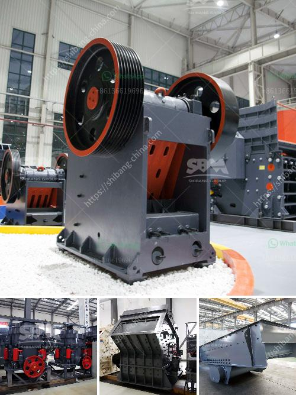

<h3>gold crusher for sale</h3>
Gold crusher, also known as gold ore crusher, is a machine designed to reduce large rocks into smaller rocks, gravel, or rock dust. It is usually used for crushing and grinding the materials that contain gold ore to a smaller size for further processing. With the rapid development of mining industry, gold ore crushers are widely used in various mining operations.

Gold crusher for sale is becoming more and more popular among investors. It is not only used in mining, but also applied in other industries such as construction, metallurgy, and chemical. There are several types of gold crushers available in the market, including jaw crusher, cone crusher, hammer crusher, impact crusher, and rotary crusher.

One of the most significant advantages of gold crusher for sale is its flexibility. It can be configured in different ways according to specific requirements. For example, a jaw crusher can be used as the primary crusher for coarse crushing. A cone crusher or impact crusher can be used for secondary crushing. Depending on the hardness and size of the gold ore, a combination of crushers can also be used to achieve the desired particle size.

Besides the flexibility in configuration, gold crusher for sale also has remarkable performance. It can crush materials with high hardness and abrasive resistance. The crushing ratio is large, and the final product has a uniform size. The gold crusher has a simple structure, reliable operation, and low operating costs. It is also energy-efficient, reducing the energy consumption during crushing.

When choosing a gold crusher for sale, there are some factors that need to be considered. Firstly, the hardness of the gold ore should be taken into account. This will determine the type of crusher that is suitable for the job. Secondly, the size of the gold ore and the desired particle size of the final product should also be considered. A crusher with a larger feed opening and adjustable discharge is ideal for processing various sizes of gold ore.

In addition to the factors mentioned above, the price and quality of the gold crusher for sale are also important considerations. It is recommended to choose a reliable manufacturer or supplier with a good reputation in the market. This ensures that the gold crusher is of high quality and will provide long-term service. Comparing prices from different suppliers is also a wise move to get the best deal.

To conclude, gold crusher for sale plays a crucial role in gold ore mining and processing. It offers a flexible and efficient solution for crushing gold ore. With its remarkable performance, it has become increasingly popular among investors. When choosing a gold crusher, factors such as hardness, size, price, and quality should be taken into consideration. By making the right choice, investors can maximize their profits and achieve success in the mining industry.
<h3>Contact us</h3><ul><li><strong>Whatsapp:&nbsp;<a href="https://wa.me/8613661969651">+8613661969651</a></strong></li><li><a href="https://swt.shibang-china.com/?git&amp;zhl&amp;gold crusher for sale"><strong>Online Service(chat now)</strong></a></li></ul><h3>Related</h3><ul><li><a href='best stone crushers india.md'>best stone crushers india</a></li><li><a href='bentonite grinding machines price.md'>bentonite grinding machines price</a></li><li><a href='sell crusher of jaw in peru.md'>sell crusher of jaw in peru</a></li><li><a href='lafarge evander quartz crushers.md'>lafarge evander quartz crushers</a></li><li><a href='granite quarry machinery for sale.md'>granite quarry machinery for sale</a></li></ul>