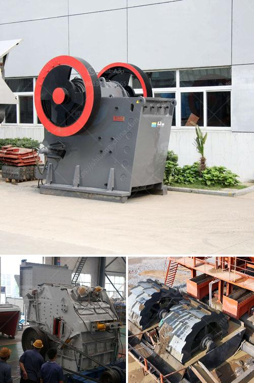

<h3>gold mining and crusher machinery</h3>
Gold mining is a process in which gold is extracted from the earth using various methods such as underground mining, placer mining, and suction dredging. According to statistics, there are roughly 900,000 active gold mines worldwide, and nearly 12% of global exploration budgets are allocated to gold mining. Crusher machinery, also known as pulverizing equipment, efficiently breaks down the rubble and rocks extracted during gold mining. These powerful machines enable miners to process large quantities of gold-bearing material, increasing the operational efficiency and profitability of the mining operation.

One of the primary crushers used in gold mining is the jaw crusher. These are exceptionally robust machines that are designed to break down large rocks into smaller, more manageable sizes. The jaw crusher has a high crushing ratio, which further reduces the size of the material. It uses a compressive force to crush the material between a stationary plate and a moving plate, thus breaking it down into smaller pieces suitable for further processing.

Another commonly used crusher machinery in gold mining is the impact crusher. This machine uses a high-speed rotor to crush materials, creating a powerful impact force. The impact crusher is especially useful in processing gold-bearing ores, as it can effectively break down large rock chunks and separate the gold particles from rocks and other minerals.

Cone crushers are also widely employed in the gold mining industry. They are similar to gyratory crushers but have a shorter spindle with a smaller crushing chamber. Cone crushers are often used for secondary crushing, where the material is further reduced in size before being processed.

In conclusion, crusher machinery plays a crucial role in gold mining. These powerful machines efficiently break down rocks and rubble, enabling the extraction of gold from the earth. Whether it is a jaw crusher, impact crusher, or cone crusher, these units are indispensable in modern gold mining operations. By using reliable and efficient crusher machinery, gold miners can maximize their production and generate higher profits from their operations.
<h3>Contact us</h3><ul><li><strong>Whatsapp:&nbsp;<a href="https://wa.me/8613661969651">+8613661969651</a></strong></li><li><a href="https://swt.shibang-china.com/?git&amp;zhl&amp;gold mining and crusher machinery"><strong>Online Service(chat now)</strong></a></li></ul><h3>Related</h3><ul><li><a href='calcium carbide making machine used.md'>calcium carbide making machine used</a></li><li><a href='coal crusher manufacturer in mumbai.md'>coal crusher manufacturer in mumbai</a></li><li><a href='crushers plant price.md'>crushers plant price</a></li><li><a href='stone crusher plant hire gold in zimbabwe.md'>stone crusher plant hire gold in zimbabwe</a></li><li><a href='single super phosphate plants in germany.md'>single super phosphate plants in germany</a></li></ul>