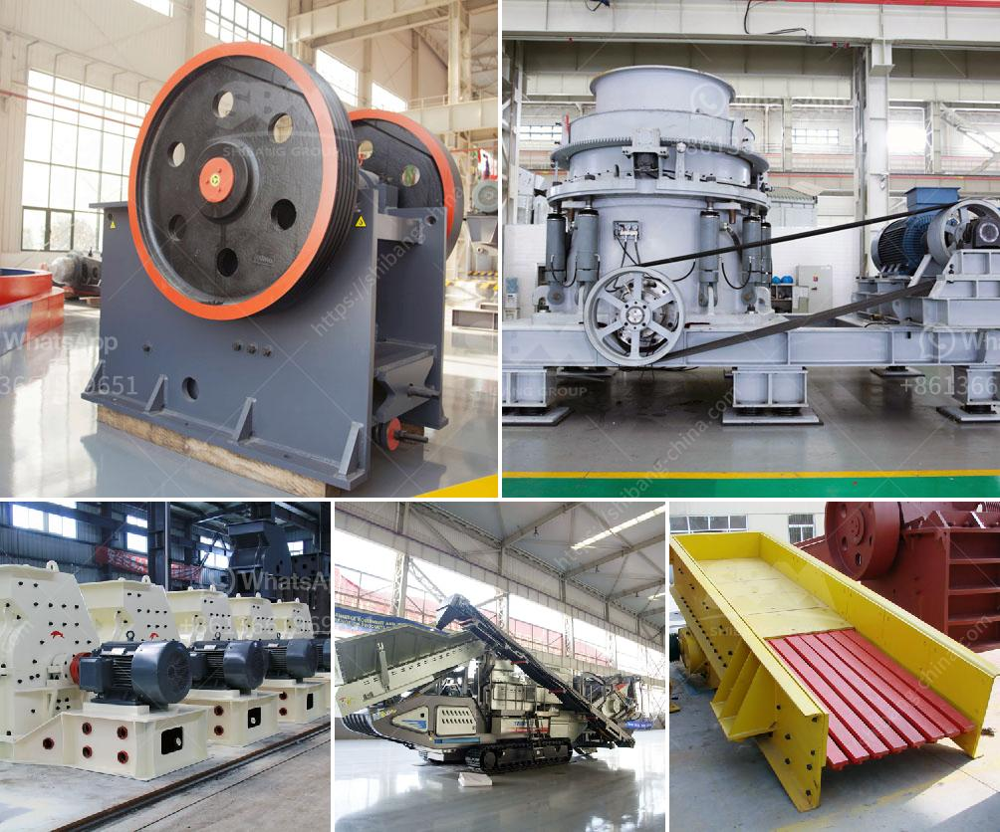

<h3>gold mining equipments manufacturers in denmark</h3>
Gold has been a valuable commodity throughout history, and its allure continues to captivate investors and enthusiasts all over the world. Denmark, a small Scandinavian country known for its exceptional engineering and manufacturing capabilities, is home to several gold mining equipment manufacturers that cater to both domestic and international markets.

One of the leading manufacturers in Denmark is FLSmidth, a global company specializing in sustainable mining and cement solutions. FLSmidth has a long history of excellence in the mining industry and offers a comprehensive range of equipment for gold mining operations.

FLSmidth's gold mining equipment portfolio includes crushing and grinding equipment, gravity separation, flotation, and dewatering systems. Their high-quality machinery is designed to enhance the efficiency and productivity of gold extraction processes, ensuring maximum recovery rates while minimizing environmental impact.

Another Danish manufacturer of gold mining equipment is KIESERLING Machinery. With more than 100 years of experience, KIESERLING is renowned for its innovative designs and technological advancements. They offer a wide range of equipment, including gold smelting and refining systems, as well as state-of-the-art gold assay laboratories.

KIESERLING's equipment is designed to meet the specific needs of gold mining operations, providing accurate and reliable results. Their gold smelting and refining systems ensure the purification and separation of gold from impurities, while their assay laboratories offer precise analysis to determine the quality and value of gold samples.

Denmark is also home to Dansk Laboratorieudstyr (DLAB), a company specializing in laboratory equipment and supplies for various industries, including mining. DLAB offers a range of equipment suitable for gold mining laboratories, including crushers, pulverizers, and sample preparation systems.

DLAB's high-quality laboratory equipment enables efficient testing and analysis of gold samples, ensuring accurate results for decision-making in gold mining operations. With their extensive range of products and technical expertise, DLAB contributes to the overall success and advancement of the gold mining industry.

These Danish gold mining equipment manufacturers, along with others, share a common commitment to innovation, quality, and sustainability. Their equipment is designed to optimize gold extraction processes, enhancing productivity while minimizing environmental impact. Additionally, their expertise and technical support ensure that gold mining operations can achieve maximum efficiency and profitability.

As the demand for gold continues to rise globally, the need for reliable and efficient mining equipment becomes increasingly important. Danish manufacturers excel in meeting these demands through their cutting-edge designs, advanced technologies, and commitment to sustainable mining practices. Whether it's crushing and grinding equipment, gold smelting and refining systems, or laboratory testing equipment, Denmark's manufacturers offer a comprehensive range of solutions for the gold mining industry.

In conclusion, Denmark's gold mining equipment manufacturers have established themselves as leaders in the industry, providing innovative and sustainable solutions for gold extraction processes. With their advanced machinery, technical expertise, and commitment to environmental responsibility, Danish manufacturers are well-positioned to contribute to the success and growth of the global gold mining industry.
<h3>Contact us</h3><ul><li><strong>Whatsapp:&nbsp;<a href="https://wa.me/8613661969651">+8613661969651</a></strong></li><li><a href="https://swt.shibang-china.com/?git&amp;zhl&amp;gold mining equipments manufacturers in denmark"><strong>Online Service(chat now)</strong></a></li></ul><h3>Related</h3><ul><li><a href='crusher stone manufacture from china.md'>crusher stone manufacture from china</a></li><li><a href='cement plant in riyadh.md'>cement plant in riyadh</a></li><li><a href='gravel wash plant for sale.md'>gravel wash plant for sale</a></li><li><a href='double toggle jaw crusher advantages.md'>double toggle jaw crusher advantages</a></li><li><a href='grinding mill cocoa powder plant duyvis.md'>grinding mill cocoa powder plant duyvis</a></li></ul>