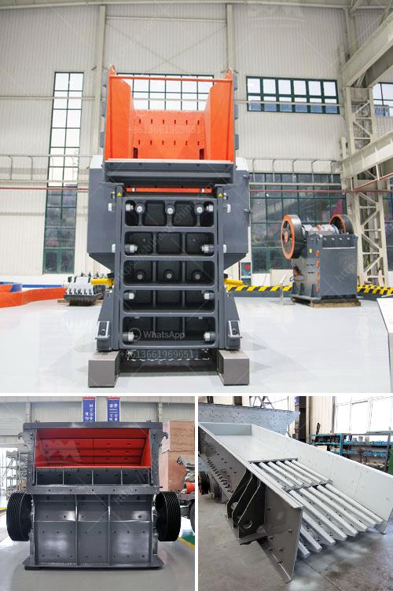

<h3>gold mining machine indonesia equipment nigeria</h3>
Indonesia is rich in minerals, including gold. It is a country that has substantial reserves of the precious metal. Besides, the gold mining in the country has a long history and dates back to the ancient times. Today, it can be said that gold mining continues to be a key contributor to the economic growth of the nation.

One of the famous gold mines in Indonesia is the Grasberg Mine. This mine is located in the Papua province of Indonesia and is considered to be one of the largest gold mines in the world. The mine utilizes both open-pit and underground mining methods to extract gold and copper. The Grasberg Mine is owned and operated by the US-based company Freeport-McMoRan.

To extract gold efficiently, modern gold mining machines are used, and in this article, we will discuss the different types of gold mining machines utilized in Indonesia.

One of the most common machines used in gold mining is the centrifugal concentrator. This machine is highly efficient in recovering fine gold particles and is the preferred choice for many gold miners. The centrifugal concentrator works by spinning a bowl-shaped container at high speeds, creating a centrifugal force that separates the heavy particles, including gold, from the lighter material.

Another commonly used machine is the gold shaking table. This machine utilizes the principles of gravity and fluid dynamics to separate gold from other minerals. The shaking table consists of a flat surface that is inclined and has riffles or grooves to catch the gold particles. As the table vibrates, the heavy particles, including gold, settle into the grooves, while the lighter material is washed away.

Gold mining in Indonesia also utilizes suction dredges. These are large machines equipped with powerful pumps that can extract gold from riverbeds or the ocean floor. Suction dredges are especially efficient in areas where the gold is present in large quantities but is spread out over a large area. These machines suck up the material containing gold, including sand, gravel, and rocks, and the captured material is then processed to extract the gold.

Moreover, the usage of sluice boxes is also prevalent in gold mining in Indonesia. These boxes are long, narrow troughs that have riffles or baffles. The material containing gold is fed into the sluice box, and as the water flows through it, the gold settles into the riffles, while the lighter material is washed away. The trapped gold can then be collected and further processed.

In conclusion, gold mining in Indonesia is carried out using various types of machines to extract gold efficiently. These machines include centrifugal concentrators, gold shaking tables, suction dredges, and sluice boxes. Each machine has its advantages in specific mining situations and contributes to the overall success of gold mining operations in Indonesia. With the utilization of modern equipment and techniques, Indonesia's gold mining industry is poised to continue its growth and contribute to the country's economic prosperity.
<h3>Contact us</h3><ul><li><strong>Whatsapp:&nbsp;<a href="https://wa.me/8613661969651">+8613661969651</a></strong></li><li><a href="https://swt.shibang-china.com/?git&amp;zhl&amp;gold mining machine indonesia equipment nigeria"><strong>Online Service(chat now)</strong></a></li></ul><h3>Related</h3><ul><li><a href='jaw crusher 200 tonnes per hour.md'>jaw crusher 200 tonnes per hour</a></li><li><a href='gypsum powder making machine pdf.md'>gypsum powder making machine pdf</a></li><li><a href='clay brick crusher manufacturers in pakistan.md'>clay brick crusher manufacturers in pakistan</a></li><li><a href='crusher plant dolomite.md'>crusher plant dolomite</a></li><li><a href='complete stone crushing 300 tph plant.md'>complete stone crushing 300 tph plant</a></li></ul>