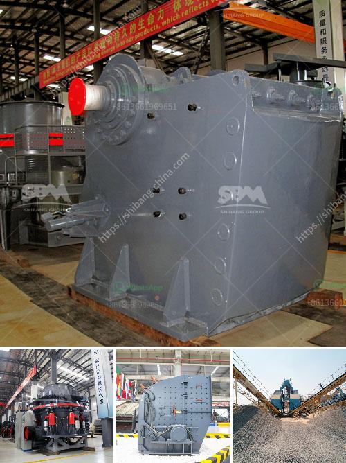

<h3>gold mining machines manufacturers from italy</h3>
Italy is not well-known for its gold mining sector. With that being said, it has certainly played a significant role in the industry. Many ancient civilizations, such as the Romans, relied on Italy for the gold that adorned their jewelry and monuments. This appreciation for gold extends to the present day, as Italy is home to a number of gold mining machinery manufacturers. 

Some of these companies are world-renowned, while others are lesser-known but still capable of producing reliable machines for the gold mining industry. We have compiled a list of these manufacturers below.

1. Italimpianti Orafi - This company, located in Arezzo, Italy, is one of the world's leading manufacturers of gold refining plants and machinery. It offers a wide range of innovative equipment for gold mining and refining processes.

2. Nasta - Nasta, based in Paderno Dugnano, specializes in manufacturing heavy-duty gold mining equipment. Their machines are specifically designed for deep mining operations and are known for their durability and efficiency.

3. GANZ - GANZ is an Italian company that has been manufacturing gold mining equipment since the 1980s. Their machines are known for their advanced technology and high productivity, making them a popular choice among gold miners worldwide.

4. Brevini - Although not solely focused on gold mining machinery, Brevini, based in Reggio Emilia, Italy, offers a range of power transmission equipment used in the mining industry. Their products, such as gearboxes and drives, ensure smooth and efficient operations in gold mines.

5. Orostudio Italy - Orostudio Italy, located in Capolona, specializes in the production of gold refining plants and innovative machines for gold mining. Their designs prioritize sustainability and environmental protection, making them a choice for environmentally conscious mining companies.

These Italian manufacturers contribute to the global gold mining industry through their high-quality machines and innovative solutions. Although Italy may not be the first country that comes to mind when thinking about gold mining, these companies have proven themselves as reliable partners for miners worldwide.
<h3>Contact us</h3><ul><li><strong>Whatsapp:&nbsp;<a href="https://wa.me/8613661969651">+8613661969651</a></strong></li><li><a href="https://swt.shibang-china.com/?git&amp;zhl&amp;gold mining machines manufacturers from italy"><strong>Online Service(chat now)</strong></a></li></ul><h3>Related</h3><ul><li><a href='ball mill for powder.md'>ball mill for powder</a></li><li><a href='copper refinery machine south africa.md'>copper refinery machine south africa</a></li><li><a href='used limestone milling machine.md'>used limestone milling machine</a></li><li><a href='rotary vacuum paddle dryer india.md'>rotary vacuum paddle dryer india</a></li><li><a href='mineral processing equipment.md'>mineral processing equipment</a></li></ul>