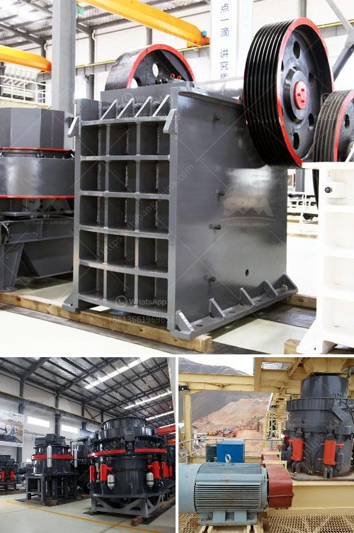

<h3>gold ore crushers for sale in india</h3>
Gold is one of the most precious metals in the world, known for its shimmering beauty and exceptional durability. It has been used throughout history for various purposes, including jewelry, currency, and as a symbol of wealth and prosperity. In order to obtain gold, it must first be extracted from the earth in the form of gold ore.

Gold ore is a type of ore that contains gold and other valuable minerals, such as silver and copper. It is extracted from the ground and processed to extract the precious metal. The extraction process involves crushing the ore into small pieces, which are then sent to specialized crushers for further processing.

In India, there is a growing demand for gold ore crushers. With the increasing price of gold, many investors are seeking opportunities to mine and process gold ore. As a result, the market for gold ore crushers is also expanding. According to statistics, India is one of the world's largest gold producers and has a significant amount of gold reserves.

Gold ore crushers for sale in India are popular in the market. In India, gold jaw crusher is popular with the mining operators and investors who want to crush gold ore into small pieces to extract gold from it. The gold jaw crusher produced by our company features high efficiency, low operating costs, and stable performance. It is widely used in gold mining process in India.

With the development of technology and the improvement of crushing technology, more and more gold ore crushers have been put into use in India. Although the market for gold ore crushers in India is still relatively small, the equipment performs well in various mineral processing tasks, providing customers with high-quality and low-cost machines.

In summary, the gold ore crushers available for sale in India have gained a good reputation among local gold investors. India possesses extensive gold ore reserves and the demand for gold ore crushers is on the rise. Gold ore crushers have a wide range of applications and can be used in mining, smelting, construction, and even chemical plants. The crushers have shown their exceptional performance in gold extraction and processing, providing an excellent opportunity for investors in India to mine and process gold ore efficiently.
<h3>Contact us</h3><ul><li><strong>Whatsapp:&nbsp;<a href="https://wa.me/8613661969651">+8613661969651</a></strong></li><li><a href="https://swt.shibang-china.com/?git&amp;zhl&amp;gold ore crushers for sale in india"><strong>Online Service(chat now)</strong></a></li></ul><h3>Related</h3><ul><li><a href='high capacity stone hammer crusher.md'>high capacity stone hammer crusher</a></li><li><a href='salary of crusher operer in philippines.md'>salary of crusher operer in philippines</a></li><li><a href='marble granding machine price in india.md'>marble granding machine price in india</a></li><li><a href='stone crusher price in ethiopia.md'>stone crusher price in ethiopia</a></li><li><a href='gypsum powder production plants.md'>gypsum powder production plants</a></li></ul>