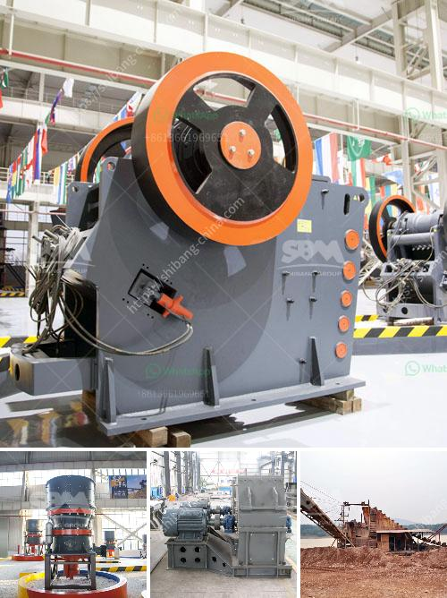

<h3>gold processing company china</h3>
Gold has been a timeless symbol of wealth and prosperity throughout human history. With its high economic and cultural value, the process of extracting gold from underground mines and transforming it into pure, marketable form has become a crucial industry worldwide. In recent years, China has emerged as a dominant player in gold processing, leveraging its advanced technology, vast resources, and skilled workforce. This article explores the growth and significance of gold processing companies in China, highlighting their impact on the global market.

China's gold processing industry has experienced a remarkable growth surge in recent decades. The country's rich reserves of gold, combined with significant investments in research and development, have allowed it to bolster its extraction capabilities. Today, China is the largest gold producer in the world, accounting for approximately 12% of global production.

One key advantage for Chinese gold processing companies is the abundance of gold mines within the country's borders. China's geography is naturally blessed with substantial gold-bearing areas, such as the provinces of Shandong, Henan, and Inner Mongolia. Continuous exploration and extraction efforts, supported by cutting-edge technology and machinery, have propelled China's gold processing industry to new heights.

China's gold processing companies have made significant strides in technological advancements, adopting modern techniques and equipment for efficient and environmentally friendly gold extraction. The industry has transitioned from traditional mining methods into more high-tech approaches, such as cyanide leaching, carbon-in-pulp, and heap leaching technology. These methods improve gold recovery rates and minimize environmental impact, boosting the sustainability and competitiveness of Chinese gold processing operations.

Additionally, Chinese companies have embraced automation and digitization to streamline processing operations. Robotics, artificial intelligence, and machine learning have been integrated into various aspects of the gold processing chain, enhancing accuracy, productivity, and overall efficiency. China's technological prowess and continuous investment in research and development have contributed to maintaining its position as a global leader in gold processing.

China's rise in the gold processing sector has had a profound impact on the global market. Chinese companies not only cater to domestic demand but also export gold across the globe. The country's production has successfully satisfied its growing appetite for gold and enabled it to become an important player in international trade.

This growing influence has prompted international gold mining companies to forge partnerships with Chinese firms, facilitating knowledge transfer and technology exchange. Many multinational mining corporations now collaborate with Chinese entities to gain access to China's technological expertise and benefit from its vast resources. Such collaborations have contributed to the continuous evolution of gold processing techniques on a global scale.

China's ascent to becoming a prominent gold processing giant is a testament to its remarkable economic growth and technological prowess. The country's abundant gold reserves, coupled with its steadfast commitment to innovation, have positioned it as a leader in the global gold market. By embracing advanced processes, automation, and sustainable practices, Chinese gold processing companies have transformed the industry, contributing to its environmental sustainability and international competitiveness. As China continues to strengthen its position, the gold processing landscape is set to witness further innovation and increased collaboration between Chinese and international entities.
<h3>Contact us</h3><ul><li><strong>Whatsapp:&nbsp;<a href="https://wa.me/8613661969651">+8613661969651</a></strong></li><li><a href="https://swt.shibang-china.com/?git&amp;zhl&amp;gold processing company china"><strong>Online Service(chat now)</strong></a></li></ul><h3>Related</h3><ul><li><a href='cost in india of 100 ton mobile limestone crusher.md'>cost in india of 100 ton mobile limestone crusher</a></li><li><a href='sand washing machines for crusher nepal.md'>sand washing machines for crusher nepal</a></li><li><a href='second hand dry cleaning machines uk.md'>second hand dry cleaning machines uk</a></li><li><a href='gold processing equipment for sale in zimbabwe.md'>gold processing equipment for sale in zimbabwe</a></li><li><a href='quarry equipment prices.md'>quarry equipment prices</a></li></ul>