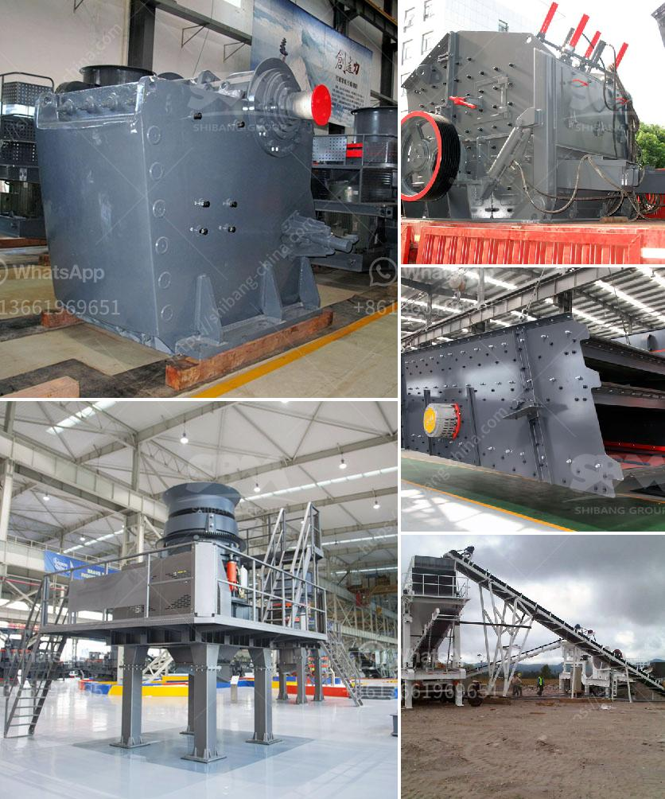

<h3>gold processing equipment for sale in zimbabwe</h3>
Gold mining has been a long-standing and lucrative activity in Zimbabwe. With rich gold deposits all around the country, there are several companies and individuals willing to invest in gold mining. To ensure that gold extraction is done efficiently and effectively, specialized gold processing equipment is required. Fortunately, there are various options available on the market, making it easier for investors and mining companies to find the right equipment for their needs.

One popular option for gold processing equipment in Zimbabwe is the gravity separator. This equipment uses the principle of gravity and specific gravity differences to separate gold from other materials. It is an effective and low-cost method that does not require any chemicals or additional energy sources. The gravity separator can handle large volumes of material, allowing for high production rates.

Another commonly used gold processing equipment is the cyanide leaching tank. This equipment is used to dissolve gold particles from their ores using cyanide as the leaching agent. The cyanide solution is then processed using various techniques to extract the gold. Cyanide leaching tanks are widely used in large-scale gold mines due to their high processing capacity and efficient gold recovery rates.

In addition to the gravity separator and cyanide leaching tanks, there are other types of gold processing equipment available in Zimbabwe. These include flotation machines, which are used to separate gold particles from other minerals through the process of froth flotation. Flotation machines are ideal for processing low-grade gold ores or tailings.

Another popular option is the gold shaking table. This equipment uses a shaking motion to separate gold particles from ore or heavy minerals. The shaking table is particularly effective in processing fine and micro-sized gold particles. It is commonly used in artisanal and small-scale gold mining operations, as it is relatively affordable and easy to operate.

When selecting gold processing equipment in Zimbabwe, it is important to consider factors such as the scale of operations, budget, and environmental impact. Some equipment options may be more suitable for large-scale mining operations, while others are better suited for small-scale or artisanal mining. It is also crucial to ensure that the chosen equipment complies with local regulations and environmental standards.

In conclusion, gold processing equipment is essential for efficiently extracting gold from its ores in Zimbabwe. The gravity separator, cyanide leaching tanks, flotation machines, and gold shaking tables are some of the commonly used equipment options. Depending on the scale of operations and specific requirements, investors and mining companies can choose the equipment that best suits their needs. It is important to consider factors such as cost, processing capacity, and environmental impact when selecting gold processing equipment.
<h3>Contact us</h3><ul><li><strong>Whatsapp:&nbsp;<a href="https://wa.me/8613661969651">+8613661969651</a></strong></li><li><a href="https://swt.shibang-china.com/?git&amp;zhl&amp;gold processing equipment for sale in zimbabwe"><strong>Online Service(chat now)</strong></a></li></ul><h3>Related</h3><ul><li><a href='limestone processing limestone processing plant.md'>limestone processing limestone processing plant</a></li><li><a href='aggregate crusher for sale in philippines.md'>aggregate crusher for sale in philippines</a></li><li><a href='price of granite crusher tons per hour.md'>price of granite crusher tons per hour</a></li><li><a href='portable diamond washing plant.md'>portable diamond washing plant</a></li><li><a href='crawler type mobile crushers.md'>crawler type mobile crushers</a></li></ul>