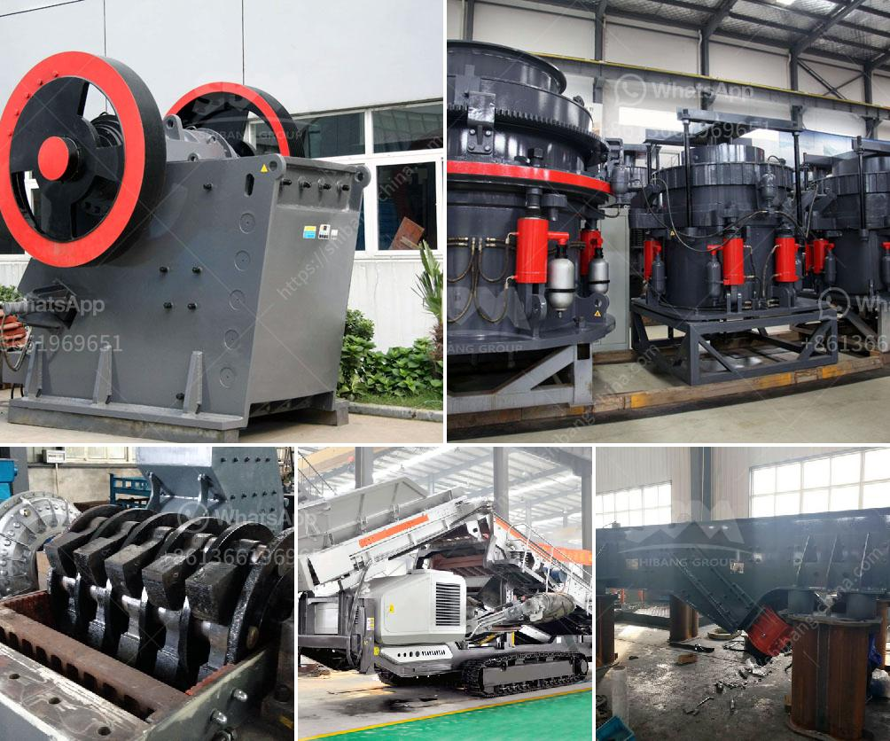

<h3>gold processing mill for sale</h3>
Are you a mining enthusiast looking to invest in a gold processing mill for sale? If so, you're in luck! A gold processing mill is a facility where gold ore is finely crushed, purified, and transformed into valuable gold bars or as per the needs of the market.

Acquiring a gold processing mill can be a lucrative investment as the demand for gold remains constant and, in many cases, continues to rise. The mill acts as the primary processing unit for extracting gold from raw ore. It efficiently breaks down large chunks of mineral-rich rocks into smaller, more manageable sizes, ensuring optimal gold extraction.

Investing in a gold processing mill for sale offers numerous benefits. Firstly, it allows you to capitalize on the high demand for gold, putting you in a profitable position. Moreover, gold is widely regarded as a safe-haven asset, making it an appealing investment option during times of economic uncertainty. This means that even in uncertain times, the value of gold remains relatively stable.

When looking for a gold processing mill for sale, it is crucial to consider factors such as its processing capacity, cost-effectiveness, and the durability of the machinery. A mill with a higher processing capacity will yield more gold, increasing returns on your investment. Additionally, opting for an energy-efficient mill can help reduce operational costs and increase profitability in the long run.

It is also advised to conduct a thorough inspection of the machinery before purchasing a gold processing mill. Ensuring that the equipment is in good working condition and meets regulatory standards is crucial to avoid any potential downtime or unexpected costs.

Overall, investing in a gold processing mill for sale can be a wise decision, given the constant demand for gold and its status as a valuable asset. With proper research and due diligence, you can find a mill that suits your needs, helping you embark on a fruitful and rewarding investment journey in the mining industry.
<h3>Contact us</h3><ul><li><strong>Whatsapp:&nbsp;<a href="https://wa.me/8613661969651">+8613661969651</a></strong></li><li><a href="https://swt.shibang-china.com/?git&amp;zhl&amp;gold processing mill for sale"><strong>Online Service(chat now)</strong></a></li></ul><h3>Related</h3><ul><li><a href='vertical mill china.md'>vertical mill china</a></li><li><a href='small mobile gold grinding mill in philippines.md'>small mobile gold grinding mill in philippines</a></li><li><a href='feasibility study for coal mining.md'>feasibility study for coal mining</a></li><li><a href='stone crushers kenya.md'>stone crushers kenya</a></li><li><a href='price crusher price bolivia.md'>price crusher price bolivia</a></li></ul>