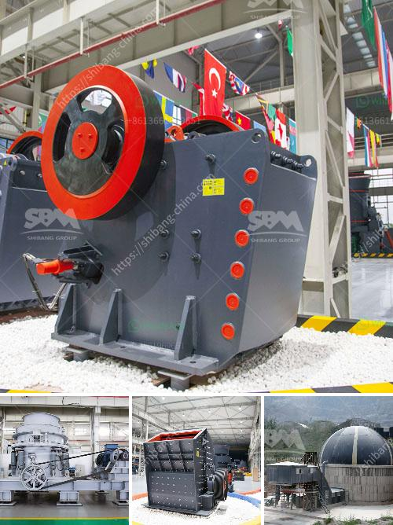

<h3>gold stamp mill for sale zim price</h3>
The gold stamp mill for sale in Zimbabwe is an essential equipment to reclaim gold from ore since all the gold is gathered from the precious metal-bearing ore, which is melted and refined before being molded into the desired final shape.

The stamp mill provides uniform crushing, which broadly liberates the gold from the gangue mineral. It crushes rocks by slamming a heavy hammer containing gold onto the ore. The stamp mill quickly pulverizes the ore and collects the gold, which is then further refined to remove impurities.

One of the major advantages of using a stamp mill is its cost-effectiveness. It offers a low-cost method to recover gold from ore compared to other methods such as using a sluice box or a chemical extraction process. The stamp mill provides a reliable and affordable way to extract gold, making it a popular option for small-scale miners in Zimbabwe.

The gold stamp mill for sale in Zimbabwe comes with various benefits for both the seller and the buyer. It provides a reliable method for the small-scale miner to process ore without costly efforts. The milling process is broadened to improve the extraction rate, which ultimately increases the potential profits for miners.

Additionally, those looking to purchase a stamp mill can expect a competitive price in the current market. The availability of these machines for sale ensures a fair market for both buyers and sellers. As the demand for gold continues to rise, the need for efficient and cost-effective extraction methods, such as stamp mills, is expected to increase as well.

Moreover, the gold stamp mill for sale in Zimbabwe allows buyers to save significantly on transportation costs. By purchasing locally, buyers avoid the high shipping expenses associated with importing heavy machinery. This further contributes to the affordability of the stamp mill and encourages local economic growth.

While the stamp mill itself is an important piece of equipment, the process goes beyond just crushing ore. Recognizing the role of stamp mills in the mining industry, the Zimbabwean government has implemented policies to support the sector. These policies aim to safeguard the interests of small-scale miners and promote sustainable mining practices.

In conclusion, the gold stamp mill for sale in Zimbabwe offers numerous benefits for buyers and sellers alike. It provides an efficient and reliable method to extract gold from ore, making it a popular choice among small-scale miners. With its cost-effectiveness and competitive pricing, the stamp mill is a valuable asset in the gold mining industry in Zimbabwe.
<h3>Contact us</h3><ul><li><strong>Whatsapp:&nbsp;<a href="https://wa.me/8613661969651">+8613661969651</a></strong></li><li><a href="https://swt.shibang-china.com/?git&amp;zhl&amp;gold stamp mill for sale zim price"><strong>Online Service(chat now)</strong></a></li></ul><h3>Related</h3><ul><li><a href='raymond grinding mill in pakistan.md'>raymond grinding mill in pakistan</a></li><li><a href='limestone screen high frequency used.md'>limestone screen high frequency used</a></li><li><a href='wet grinding of mica process and equipment.md'>wet grinding of mica process and equipment</a></li><li><a href='stone crusherproduction line.md'>stone crusherproduction line</a></li><li><a href='course sand manufacturers in india.md'>course sand manufacturers in india</a></li></ul>