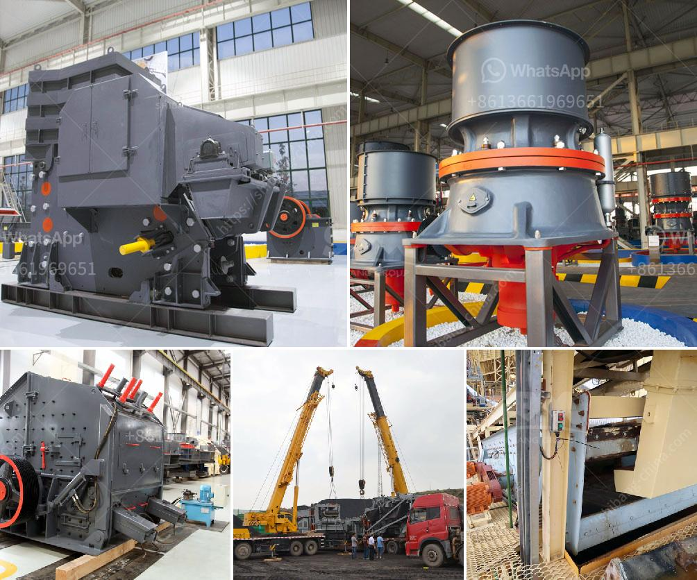

<h3>gold wash plant equipment in ghana</h3>
Gold mining in Ghana has been carried out for centuries, dating back to the pre-colonial era. The country is one of the largest producers of gold in Africa, ranking second only to South Africa. Gold mining contributes significantly to the economy of Ghana, making it an important sector of the country's economy.

Ghana has vast gold deposits, particularly in the Ashanti region, where it is estimated that over 40% of Ghana's total gold production comes from. The region alone is said to contain over 50 million ounces of gold, making it one of the richest gold belts in the world.

Gold mining in Ghana is mainly done through small-scale mining activities, with illegal mining also playing a significant role. Small-scale mining is carried out by individuals, local communities, and licensed companies. Gold wash plant equipment in Ghana has been widely used in various mining methods and cater to the needs of both small and large-scale mining operations.

The gold wash plant is a versatile piece of equipment that is used to extract gold from gravel and clay deposits. This equipment can be used in gold mining operations regardless of the size of the operation. The equipment is efficient, reliable, and offers high recovery rates.

One notable feature of the gold wash plant equipment in Ghana is its ability to handle varying types of soils. It is designed for easy operation and maintenance, capable of efficiently processing different types of ores including alluvial, eluvial, and hard rock deposits. This versatility allows miners to extract gold from various types of deposits without the need for additional equipment.

The gold wash plant equipment in Ghana typically features a trommel screen, which is used to separate the gold-bearing material from the waste material. Depending on the size of the operation, the trommel screen can be equipped with additional features such as sluice boxes, jigs, or centrifugal concentrators to further enhance gold recovery.

In addition to the trommel screen, the gold wash plant equipment in Ghana may also include other equipment such as crushers, vibrating feeders, and vibrating screens. These auxiliary equipment are essential in the gold mining process, providing support and facilitating the efficient extraction of gold from the ore.

The gold wash plant equipment in Ghana is available in various configurations and sizes, catering to the specific needs of different mining operations. Whether it is a small-scale operation or a large-scale mining project, there are options available to suit the requirements and budget of every miner.

In conclusion, gold wash plant equipment in Ghana plays a vital role in the mining industry. It enables miners to extract gold efficiently and effectively from various types of deposits. With the right equipment, gold mining operations in Ghana can be profitable and sustainable, contributing to the growth and development of the country's economy.
<h3>Contact us</h3><ul><li><strong>Whatsapp:&nbsp;<a href="https://wa.me/8613661969651">+8613661969651</a></strong></li><li><a href="https://swt.shibang-china.com/?git&amp;zhl&amp;gold wash plant equipment in ghana"><strong>Online Service(chat now)</strong></a></li></ul><h3>Related</h3><ul><li><a href='turkey of gold refinery project cost.md'>turkey of gold refinery project cost</a></li><li><a href='kaolin crusher processing in japan.md'>kaolin crusher processing in japan</a></li><li><a href='small cone crushers.md'>small cone crushers</a></li><li><a href='calcium carbonate grinding plant.md'>calcium carbonate grinding plant</a></li><li><a href='barite crusher manufacturer guatemala.md'>barite crusher manufacturer guatemala</a></li></ul>