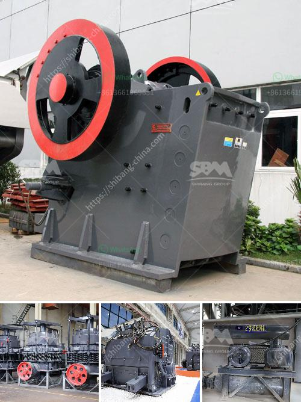

<h3>gold wash plant for sale in the usa</h3>
Gold mining has been a lucrative industry for centuries, and with the ever-increasing demand for this precious metal, it shows no signs of slowing down. One crucial aspect of gold mining is the effective extraction of gold from the earth, and this has led to the development of various tools and equipment to aid in the process. Among these, the gold wash plant is an essential piece of equipment that plays a pivotal role in gold mining operations.

A gold wash plant is a piece of equipment used to wash gold-bearing soil and gravel to remove the gold particles, allowing for efficient extraction. Different designs and models of wash plants are available to suit various mining needs and budgets. These plants come in various sizes, ranging from small portable units to large industrial-sized wash plants.

If you are looking for a gold wash plant for sale in the USA, you are in luck! The United States is home to various suppliers and manufacturers of high-quality gold wash plants. These companies offer a wide range of wash plant options that cater to both small-scale and large-scale mining operations.

When searching for a gold wash plant for sale, it is important to consider factors such as processing capacity, water requirements, mobility, and ease of operation. Additionally, you should look for a wash plant that is built to withstand the harsh conditions of mining environments and is made from durable materials for long-lasting use.

The gold wash plants available in the USA are designed to efficiently recover gold from alluvial deposits and hard rock gold, making them suitable for various mining environments. With advanced technology and innovative features, these wash plants can significantly increase gold recovery rates while minimizing manual labor and operational costs.

Investing in a gold wash plant can be a wise decision for any individual or company involved in gold mining. By carefully considering your mining needs and choosing a high-quality wash plant from reliable suppliers in the USA, you can enhance your gold mining operations and increase your chances of striking it rich. So why wait? Discover the gold wash plants for sale in the USA today and kick-start your gold mining journey!
<h3>Contact us</h3><ul><li><strong>Whatsapp:&nbsp;<a href="https://wa.me/8613661969651">+8613661969651</a></strong></li><li><a href="https://swt.shibang-china.com/?git&amp;zhl&amp;gold wash plant for sale in the usa"><strong>Online Service(chat now)</strong></a></li></ul><h3>Related</h3><ul><li><a href='stone crusher machine in turkey.md'>stone crusher machine in turkey</a></li><li><a href='gypsum board manufacturing machines prices inindia.md'>gypsum board manufacturing machines prices inindia</a></li><li><a href='stone crusher plant price list.md'>stone crusher plant price list</a></li><li><a href='aggregate processing equipment.md'>aggregate processing equipment</a></li><li><a href='fdiferentes areas of stone crusher.md'>fdiferentes areas of stone crusher</a></li></ul>