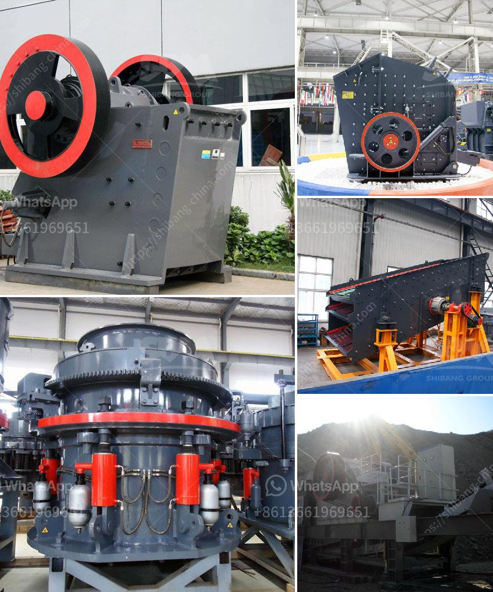

<h3>gold washing plant for sale in south africa</h3>
Gold ore is one of the most precious resources in the world. It is widely used in various industries including jewelry, electronics, and technology. However, extracting gold ore from the ground is a laborious and costly endeavor. In order to efficiently and effectively extract gold ore, a gold washing plant is needed.

A gold washing plant is a machine used to wash gold-bearing ore to separate gold particles from sand and other impurities. Gravity separation is widely used in the process of sorting gold particles from crushed ore due to its simplicity and efficiency. The gravity separation method is based on the principle that particles with different densities are subjected to different forces in a fluid medium. The sorting process can be accomplished by using shaking tables, jigs, spirals, or other concentrators.

South Africa is one of the world leaders in gold mining with its vast resources and extensive mining industry. Gold has been a valuable asset for centuries, and its importance has only intensified with the rise of technology and industrialization. With such a rich history of gold mining and a concentration of gold resources, it is no surprise that South Africa is a leading producer of this precious metal.

For those looking to invest in the gold mining industry or simply wanting to add gold to their investment portfolio, a gold washing plant for sale in South Africa is an excellent option. Given the complexity and many factors involved in gold mining, it is important to choose the right washing plant for the job. A plant that is too small or inefficient may result in lower gold yields and increased costs.

When considering a gold washing plant for sale in South Africa, investors should consider various factors such as the size of the operation, the location, the type of ore being mined, and the expected yield. Those with larger operations may require a more advanced and larger plant, while smaller operations may be able to get by with a simpler and more cost-effective option.

There are numerous suppliers of gold washing plants in South Africa. It is important to thoroughly research and evaluate each supplier's reputation, experience, and track record before making a purchase. Reading customer reviews and testimonials, as well as seeking recommendations from industry professionals, can help ensure that the chosen supplier is reputable and reliable.

Investing in a gold washing plant for sale in South Africa is a wise decision for any gold mining business. With the potential to increase production and profits, the benefits of investing in a quality machine far outweigh the costs. A gold washing plant will also ensure that the gold ore being processed is of the highest quality, resulting in higher yields and better returns on investment.

In conclusion, a gold washing plant is an essential investment for any gold mining operation in South Africa. It is a crucial tool for separating gold particles from sand and other impurities to maximize yields and profits. When considering a gold washing plant for sale, it is important to choose a reputable supplier and thoroughly evaluate the requirements and expected results of the operation. By investing in a reliable and efficient gold washing plant, businesses can ensure long-term success and profitability in the gold mining industry.
<h3>Contact us</h3><ul><li><strong>Whatsapp:&nbsp;<a href="https://wa.me/8613661969651">+8613661969651</a></strong></li><li><a href="https://swt.shibang-china.com/?git&amp;zhl&amp;gold washing plant for sale in south africa"><strong>Online Service(chat now)</strong></a></li></ul><h3>Related</h3><ul><li><a href='limestone crusher machine in turkey.md'>limestone crusher machine in turkey</a></li><li><a href='stone crusher plant philippines.md'>stone crusher plant philippines</a></li><li><a href='feldspar grinding machine chennai suppliers.md'>feldspar grinding machine chennai suppliers</a></li><li><a href='raymond mill plant.md'>raymond mill plant</a></li><li><a href='cs series cone crusher.md'>cs series cone crusher</a></li></ul>