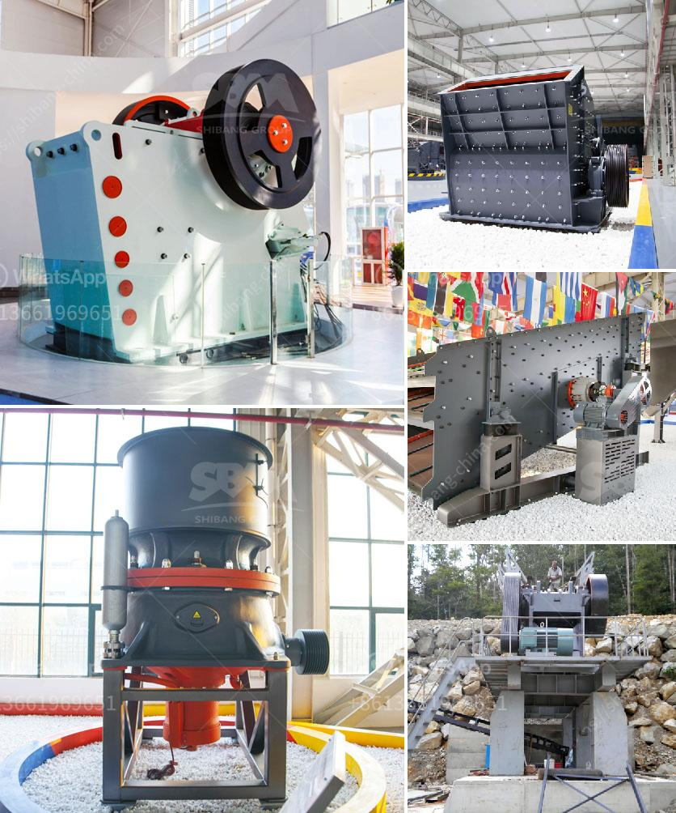

<h3>granite crusher factory</h3>
Granite has been used as a key construction material for centuries. It is an extremely hard rock that is not only aesthetically pleasing but also renowned for its durability. Granite is commonly used in the construction of buildings, highways, bridges, and pavement, making it a crucial material for any modern infrastructure. But what goes on behind the scenes to transform giant granite rocks into smaller, usable sizes? This is where a granite crusher factory comes into play.

A granite crusher factory is equipped with a range of crushing equipment that aids in the process of transforming large blocks of granite into smaller, more manageable sizes. This machinery includes jaw crushers for primary crushing, cone crushers for secondary crushing, and even vertical shaft impact crushers for tertiary crushing to produce the finest granite products.

The process of crushing granite begins with the initial feeding of the raw granite rocks into the jaw crusher, where they are crushed into smaller sizes. From there, the crushed granite pieces are sorted using vibrating screens into various sizes, making it easier for further processing. The granite is then fed into cone crushers or impact crushers, where it is further reduced in size and shaped into the desired end product.

One of the key advantages of a granite crusher factory is its ability to produce a wide range of granite products. These products can range from different sizes of granite aggregates used in construction to specific sizes of granite slabs used for countertops or decorative purposes. The versatility and flexibility of a granite crusher factory allow for the production of various granite products to cater to different market demands.

Furthermore, granite crusher factories play a crucial role in the stone crushing industry by contributing to the local economy. They offer employment opportunities to local communities and boost economic growth by extracting, producing, and selling granite products both domestically and internationally. Additionally, by recycling and reusing granite waste, these factories promote sustainable practices and contribute to environmental conservation.

In conclusion, granite crusher factories are essential for the production of high-quality granite products used in construction and other industries. They utilize advanced crushing machinery to transform large blocks of granite into smaller, more manageable sizes. These factories offer employment opportunities, boost economic growth, and promote sustainable practices. With their dedication to creating durable crushing solutions, granite crusher factories play a vital role in modern infrastructure development.
<h3>Contact us</h3><ul><li><strong>Whatsapp:&nbsp;<a href="https://wa.me/8613661969651">+8613661969651</a></strong></li><li><a href="https://swt.shibang-china.com/?git&amp;zhl&amp;granite crusher factory"><strong>Online Service(chat now)</strong></a></li></ul><h3>Related</h3><ul><li><a href='business plan on manganese ore mining crusher.md'>business plan on manganese ore mining crusher</a></li><li><a href='stone crushers for sale in south africa.md'>stone crushers for sale in south africa</a></li><li><a href='brick making machines for sale in zimbabwe.md'>brick making machines for sale in zimbabwe</a></li><li><a href='crushing and screening rustenburg.md'>crushing and screening rustenburg</a></li><li><a href='jaw crusher for sale china.md'>jaw crusher for sale china</a></li></ul>