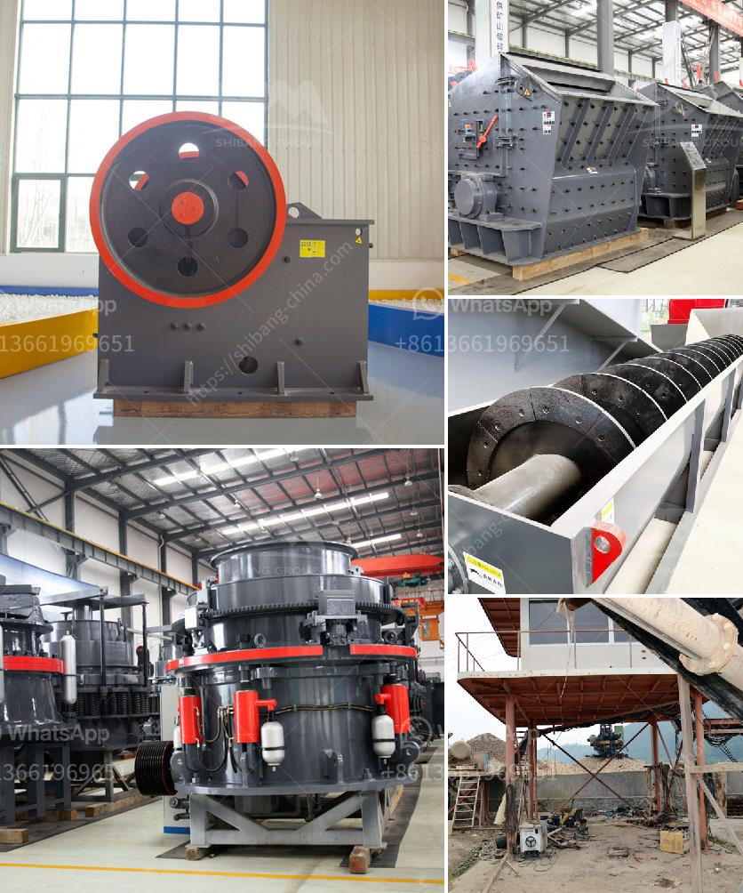

<h3>granite crusher machine philippines</h3>
Granite is a common type of igneous rock composed mainly of quartz, different feldspars, micas, and hornblende and is used in various industries, from construction to counter tops. Granite, being durable and resistant to weathering, has gained popularity as a material for constructing buildings, monuments, and other structures. With its high compressive strength and natural beauty, it is no wonder that granite has become highly sought-after.

In the Philippines, granite is abundant and widely distributed. Some estimates suggest that there are around 1.2 trillion metric tons of granite reserves in the country, making it one of the top granite producers in the world. This abundance of granite has prompted the development of various industries and technologies to extract, process, and utilize this valuable natural resource.

One such technology that has gained traction in the country is the granite crusher machine. It is a high-performance machine that is able to withstand the toughest conditions and effortlessly crush granite into desired sizes. With the use of a granite crusher machine, the quality and efficiency of granite crushing process can be improved dramatically.

Typically, the granite crushing line is consisted of primary jaw crusher, secondary cone crusher, vibrating feeder, belt conveyor, vibrating screen, and other equipment. The overall production process is similar to that in granite quarry, however, the initial crushing step is usually done with a jaw crusher. Based on the model and capacity, jaw crushers can be divided into PE jaw crusher and PEW jaw crusher. The PE series jaw crusher is suitable for primary crushing in medium hardness and low initial investment whereas the PEW jaw crusher is suitable for secondary crushing in high hardness and large capacity scenarios.

Apart from the jaw crusher, there are other granite crusher machines which can process the materials into granular at the same time, such as impact crusher, cone crusher, and double roller crusher, etc. Some of them are also suitable for processing bulk materials, such as impact crusher and hammer crusher. The appearance and working principle of these crushers are different, but their processing capacity, power consumption, and noise are all affected by various factors.

In addition to the various models of granite crusher machines mentioned above, there are also some auxiliary equipment needed in the granite crushing line, such as vibrating feeders, vibrating screens, and belt conveyors. These devices ensure the smooth operation of the entire production process and the efficient transfer of crushed materials from one equipment to another.

Over the years, the demand for granite in the Philippines has steadily increased, driven by the country's rapid urbanization and infrastructure development. As a result, the granite crusher machines in the Philippines are also in high demand. In recent years, many mining equipment suppliers in the Philippines have sought to provide customers with higher quality and more efficient machines. These suppliers invest a lot of time and effort in the research and development of new technologies to improve the performance and reliability of granite crusher machines.

In conclusion, granite is a valuable natural resource that can be efficiently processed into different sizes for various applications. The granite crusher machine is a high-performance machine developed specifically for the granite crushing process, and it is favored by users with its excellent performance and unique design. So, for granite crushing production, please choose Granite Crusher Machine Philippines to achieve the desired efficiency and productivity.
<h3>Contact us</h3><ul><li><strong>Whatsapp:&nbsp;<a href="https://wa.me/8613661969651">+8613661969651</a></strong></li><li><a href="https://swt.shibang-china.com/?git&amp;zhl&amp;granite crusher machine philippines"><strong>Online Service(chat now)</strong></a></li></ul><h3>Related</h3><ul><li><a href='copper crusher supplier.md'>copper crusher supplier</a></li><li><a href='gravel crusher machine philippines.md'>gravel crusher machine philippines</a></li><li><a href='gold ore crushers for sale in india.md'>gold ore crushers for sale in india</a></li><li><a href='cement clinker grinding unit.md'>cement clinker grinding unit</a></li><li><a href='vertical vertical roller mill drives.md'>vertical vertical roller mill drives</a></li></ul>