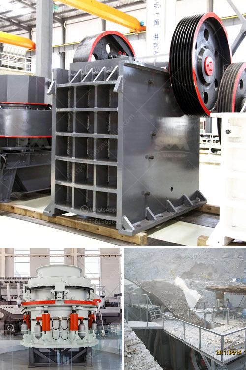

<h3>granite crusher philippines</h3>
Granite is one of the most durable and versatile materials for construction. With its natural look and abundance in the Philippines, granite is a top choice for many homeowners and builders. Known for its durability and resistance to heat and scratches, granite is the perfect material for kitchen countertops, floor tiles, and even furniture.

One essential tool in utilizing granite is the granite crusher. This powerful machine is specially designed to reduce the size of large rocks into smaller pieces, making it easier to handle and transport. The crusher breaks granite slabs into smaller pieces of rubble, which can then be used as construction aggregate or for other purposes.

In the Philippines, granite crusher is still crucial in the production of aggregates used in various construction projects. It is estimated that the country has a total of about 1.7 billion tons of granite reserves, making it one of the richest in the world. Granite mining is a capital-intensive and energy-intensive process, so the Philippines is eager to develop its granite crusher industry.

However, the crushing process of granite cannot be separated from the wear and tear of various accessories, such as the jaw plate and hammer. To extend the service life of these vulnerable parts, it is important to choose the right granite crusher with high wear resistance and impact resistance.

Fortunately, the Philippines has a wide range of granite crusher options available. These range from jaw crushers, impact crushers, cone crushers, and even mobile crushers. Each of these crushers has unique features and specifications that suit different crushing needs and requirements.

To ensure the suitability of a granite crusher for a particular project, it is essential to consider factors such as the hardness and abrasiveness of the granite, the required output size, and the production capacity. Additionally, it is vital to choose a reliable and reputable manufacturer or supplier that offers high-quality crushers and excellent after-sales service.

In conclusion, granite crusher plays a significant role in the Philippines' construction industry. It helps in reducing large granite slabs into smaller pieces for various applications. However, selecting the right granite crusher is crucial to achieve efficient crushing and maximize the benefits of granite in construction projects. With numerous options available in the market, it is essential to invest in a reliable and high-quality crusher that fits the specific requirements of the project.
<h3>Contact us</h3><ul><li><strong>Whatsapp:&nbsp;<a href="https://wa.me/8613661969651">+8613661969651</a></strong></li><li><a href="https://swt.shibang-china.com/?git&amp;zhl&amp;granite crusher philippines"><strong>Online Service(chat now)</strong></a></li></ul><h3>Related</h3><ul><li><a href='river stone crusher.md'>river stone crusher</a></li><li><a href='mobile crusher capacity 200 ton per hour.md'>mobile crusher capacity 200 ton per hour</a></li><li><a href='stone crusher and quarry plant in jordan.md'>stone crusher and quarry plant in jordan</a></li><li><a href='hammer grinder machine price.md'>hammer grinder machine price</a></li><li><a href='mobile crusher for sale in south africa.md'>mobile crusher for sale in south africa</a></li></ul>