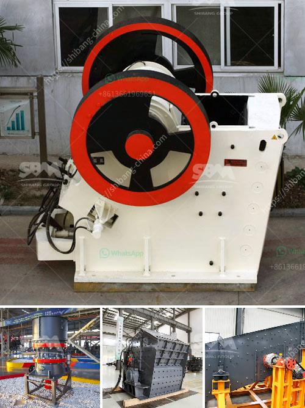

<h3>granite crusher price list</h3>
With the numerous types of granite crushers on the market, choosing the right one for your project can be a challenge. How can you determine the best granite crusher for your needs? Additionally, what factors influence the price of these machines? In this article, we will explore the price range of granite crushers and the key factors that affect their cost.

Granite crushers vary in price depending on their specifications and functions. When buying granite crushers, you should take into consideration factors such as crushing capacity, raw material requirements, output size requirements, motor power, and voltage. Each of these factors will affect the cost of the machine.

The crushing capacity of a granite crusher refers to the maximum amount of material it can crush per hour. Generally, granite crushers with higher crushing capacity are more expensive. However, investing in a crusher with a higher capacity can result in higher productivity and profitability, making it a worthwhile investment.

The type of raw material and its hardness is another crucial factor influencing the crusher's price. Different granite crushers are designed to handle different types of raw materials. For instance, some crushers are better suited for soft and less abrasive materials, while others are more suitable for harder ores. The harder the material you need to crush, the more expensive the crusher might be.

Output size requirements also play a role in determining the cost of a granite crusher. If you need a specific output size, you may need to invest in a more advanced machine with adjustable settings. A crusher that can produce a variety of output sizes will generally cost more than one with fixed settings.

Motor power and voltage are essential parameters that determine how efficiently the granite crusher operates. Higher motor power often results in improved crushing capacity and reduced downtime. Similarly, the appropriate voltage is necessary for smooth operation. Suitable voltage requirements may vary depending on your location, and special electrical arrangements may increase the cost.

Apart from these major factors, there are other considerations that can influence the price of a granite crusher. These include the brand reputation, after-sales service, availability of spare parts, and any additional features or customization you may require. It is essential to research and compare different brands and suppliers to find the best value for your money.

When looking for a granite crusher, it is crucial to strike a balance between cost and quality. While price is important, it should not be the sole determining factor. Consider the capacity, raw material requirements, and output size needed for your project. Evaluate the specifications, reputation, and availability of spare parts for different crushers to ensure you make an informed decision.

In conclusion, the price range of granite crushers varies depending on factors such as crushing capacity, raw material requirements, output size, motor power, and voltage. To make the right choice, evaluate your project requirements and research various brands and suppliers. By doing so, you can find the most suitable granite crusher that offers the best value for your investment.
<h3>Contact us</h3><ul><li><strong>Whatsapp:&nbsp;<a href="https://wa.me/8613661969651">+8613661969651</a></strong></li><li><a href="https://swt.shibang-china.com/?git&amp;zhl&amp;granite crusher price list"><strong>Online Service(chat now)</strong></a></li></ul><h3>Related</h3><ul><li><a href='small mobile gold grinding mill in philippines.md'>small mobile gold grinding mill in philippines</a></li><li><a href='raymond mill crusher price.md'>raymond mill crusher price</a></li><li><a href='advantages and disadvantages of ball mill grinding.md'>advantages and disadvantages of ball mill grinding</a></li><li><a href='talcum powder making formulation.md'>talcum powder making formulation</a></li><li><a href='stone crusher machine price in philippines.md'>stone crusher machine price in philippines</a></li></ul>