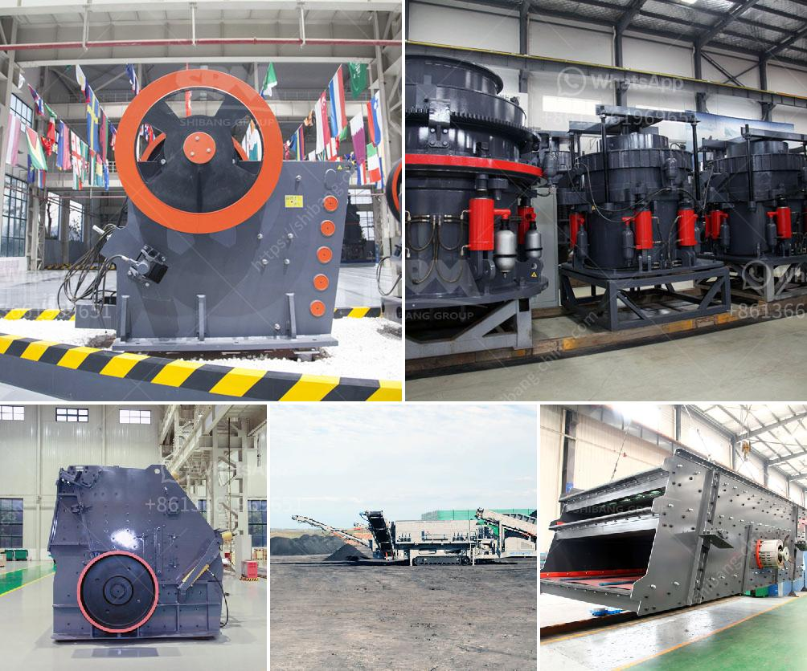

<h3>granite crushers for sale</h3>
Granite is a high-hardness rock that is difficult to crush and has a large wear on the crusher. Therefore, a reasonable crushing scheme is critical for granite production line. PE600*900 jaw crusher and cone crusher are provided in granite crushers for sale. They are suitable for all primary crushing needs from mining to contracting, and from extremely hard rock to recycling materials. These equipment combine a high reduction ratio and increased capacity with any feed materials: from extra hard rock to recycled materials, thus providing excellent results.

The jaw crusher is designed to crush all rock types from the hardest granites to abrasive ones and recycle materials. It has been the world favorite primary crushing plant in mining, construction, quarry, and recycling applications. The cone crusher is suitable for secondary and tertiary crushing stages. It is designed for efficient size reduction and low operation cost per tonne of final aggregate production.

Granite crushers for sale have a long history and advanced technology. The jaw crusher is characterized by a high crushing ratio, even size distribution, simple structure, reliable operation, easy maintenance, and low operating costs. Impact crushers are characterized by a unique blow bar fixing system providing a higher degree of reliability. Cone crushers are an excellent choice in tertiary, quaternary, secondary, and pebble-crushing applications. They are equipped with the hydraulic Hydroset system, which provides safety and setting-adjustment functions.

With the growing demand for granite in the construction industry, granite crushers for sale play a crucial role in granite processing line. They have advantages of high crushing efficiency, low consumption, reliable performance, and easy maintenance, etc. Furthermore, these crushers equipped with advanced electronic control operating system, which ensures a smooth and safe operation. Overall, granite crushers for sale provide excellent performance in granite production line, making them the best choice for construction projects.
<h3>Contact us</h3><ul><li><strong>Whatsapp:&nbsp;<a href="https://wa.me/8613661969651">+8613661969651</a></strong></li><li><a href="https://swt.shibang-china.com/?git&amp;zhl&amp;granite crushers for sale"><strong>Online Service(chat now)</strong></a></li></ul><h3>Related</h3><ul><li><a href='china talc processing factory.md'>china talc processing factory</a></li><li><a href='limestone fine grind plant for sale.md'>limestone fine grind plant for sale</a></li><li><a href='vibration screen machine.md'>vibration screen machine</a></li><li><a href='used grinding mills in nigeria.md'>used grinding mills in nigeria</a></li><li><a href='sand sieve machine philippines.md'>sand sieve machine philippines</a></li></ul>