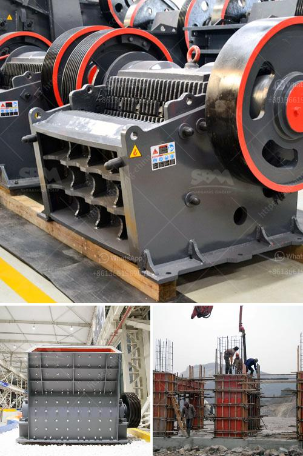

<h3>granite crushing machine for sale</h3>
Granite is a common type of intrusive, felsic, igneous rock which is granular and phaneritic in texture. This rock consists mainly of quartz, mica, and feldspar. Granites are usually pink to gray in color, depending on their mineralogy. The word granite comes from the Latin granum, which means grain.

Granite has become an essential material in various construction projects due to its durability and aesthetic appeal. However, obtaining pieces of granite in a suitable size and shape for a particular construction project can be challenging. This is where a granite crushing machine comes in handy.

A granite crushing machine is a piece of machinery that efficiently and effectively crushes and reduces granite into smaller pieces. By using a crusher, construction companies can process granite and sell it in various sizes depending on the needs of their customers.

In recent years, the demand for granite has been increasing as it is widely used in various applications, including building countertops, floors, monuments, and even artistic sculptures. Therefore, investing in a granite crushing machine for sale can be a profitable venture for construction businesses.

When searching for a granite crushing machine for sale, one must consider various factors such as the capacity of the machine, the size of the feed material, and the final product size required. Additionally, it is essential to find a machine that requires minimal maintenance and offers a high degree of reliability.

With the advancement in technology, modern granite crushing machines are equipped with advanced features such as hydraulic systems, automatic controls, and variable crushing chambers. These features enable efficient and precise crushing of granite, resulting in high-quality end products that meet the specifications of customers.

Furthermore, granite crushing machines are now more environmentally friendly, as many manufacturers incorporate advanced dust suppression systems and noise reduction measures in their machines. These features ensure that the crushing process is safe for both the operators and the environment.

In conclusion, a granite crushing machine for sale can significantly improve the productivity and profitability of a construction business. By turning raw granite into smaller pieces, the machine allows construction companies to meet the demand for granite in various applications. When purchasing a granite crushing machine, one should consider factors such as capacity, feed size, final product size, and maintenance requirements. With modern technologies and features, these machines are efficient, reliable, and environmentally friendly.
<h3>Contact us</h3><ul><li><strong>Whatsapp:&nbsp;<a href="https://wa.me/8613661969651">+8613661969651</a></strong></li><li><a href="https://swt.shibang-china.com/?git&amp;zhl&amp;granite crushing machine for sale"><strong>Online Service(chat now)</strong></a></li></ul><h3>Related</h3><ul><li><a href='business plan for stone crushing plant pdf.md'>business plan for stone crushing plant pdf</a></li><li><a href='advantages of reversible impact hammer crusher.md'>advantages of reversible impact hammer crusher</a></li><li><a href='fly ash processing plant.md'>fly ash processing plant</a></li><li><a href='mineral processing equipment cost.md'>mineral processing equipment cost</a></li><li><a href='used calcite powder plant and machinery.md'>used calcite powder plant and machinery</a></li></ul>