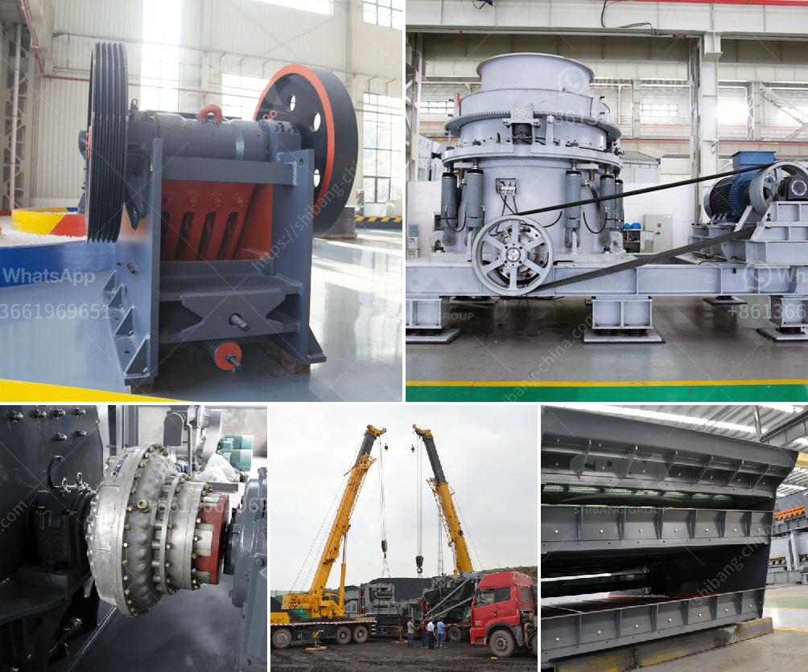

<h3>granite crushing process</h3>
Granite is a common type of igneous rock that is granular in texture. It is widely used in construction, landscaping, and other industries due to its durability and aesthetic appeal. Before it can be used for various purposes, however, it needs to go through a crushing process.

The crushing process of granite involves multiple stages designed to produce the best possible end product. Firstly, large granite materials are sent to the jaw crusher for primary crushing, reducing the size of the rocks to approximately 150-200mm. The jaw crusher then further crushes the crushed granite to smaller sizes, typically no larger than 60mm. This smaller-sized material is referred to as crushed granite aggregate.

After being crushed by the jaw crusher, the crushed granite aggregate is then sent to the cone crusher for secondary crushing. The cone crusher further breaks down the granite into smaller pieces with a feed size of less than 40mm. This crushed granite material is known as the final product and is used for various applications such as concrete production, road construction, and railway ballast.

During the crushing process, it is important to monitor and control the size distribution of the crushed granite. This is achieved through the use of screening equipment. The crushed granite is screened through a series of vibrating screens to separate the desired sizes from the oversize and undersize materials. The screens are designed to ensure that only the appropriate sized granites pass through, while the rest are returned to the crusher for further crushing.

In addition to crushing and screening, another important aspect of the granite crushing process is the use of a conveyor system. A conveyor system allows for the efficient transportation of the crushed granite from one stage to another, eliminating the need for manual handling and reducing the risk of accidents or injuries.

The entire granite crushing process is carefully regulated to ensure that the final product meets the required specifications and standards. Quality control measures are implemented at each stage to ensure that the crushed granite is of the highest quality and is suitable for its intended use. This involves monitoring factors such as particle shape, particle size distribution, and gradation.

Overall, the granite crushing process is a vital step in the production of high-quality granite aggregate. It involves multiple stages and careful monitoring to ensure that the end product meets the required specifications. By employing the right crushing equipment, screening systems, and quality control measures, the granite crushing process can be highly efficient and yield excellent results.
<h3>Contact us</h3><ul><li><strong>Whatsapp:&nbsp;<a href="https://wa.me/8613661969651">+8613661969651</a></strong></li><li><a href="https://swt.shibang-china.com/?git&amp;zhl&amp;granite crushing process"><strong>Online Service(chat now)</strong></a></li></ul><h3>Related</h3><ul><li><a href='stone crusher plant price list.md'>stone crusher plant price list</a></li><li><a href='rollers for stone ball mills.md'>rollers for stone ball mills</a></li><li><a href='gypsum crusher plants in pakistan.md'>gypsum crusher plants in pakistan</a></li><li><a href='grinding mill machine gebraucht.md'>grinding mill machine gebraucht</a></li><li><a href='manufacturers of mobile crushing plants.md'>manufacturers of mobile crushing plants</a></li></ul>