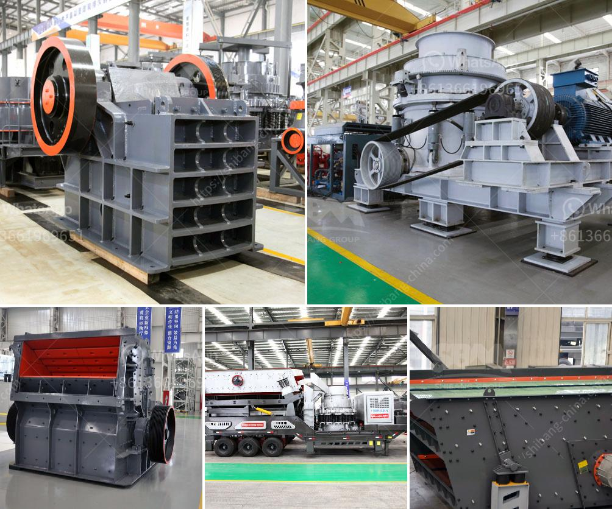

<h3>granite milling unit</h3>
Granite, renowned for its durability and aesthetics, has long been a popular choice for kitchen countertops, flooring, and other construction purposes. However, the process of transforming raw granite into finished products requires specialized machinery. The granite milling unit serves as the backbone of the stone industry, enabling the efficient and precise shaping and polishing of this natural stone.

A granite milling unit is a large machine used for cutting and shaping granite slabs into various sizes and thicknesses. These units consist of multiple cutting blades, diamond-tipped tools, and a powerful motorized system capable of handling heavy loads. They are equipped with advanced technology such as CNC (Computer Numerical Control) systems, which allow for precise and automated operations.

One of the key steps in the granite milling process is slab cutting. This involves feeding large granite blocks into the milling unit, which then cuts them into thinner slabs. The cutting blades, often made of diamond segments, rotate at high speeds, smoothly slicing through the granite. The precision of the cutting process is essential to ensure uniformity in size and thickness, as well as to minimize material waste.

Once the slabs are cut, the next step is shaping and edging. The granite milling unit employs various tools, such as profile wheels and routers, to shape the edges of the stone. These tools can create a variety of profiles, including bullnose, beveled, and ogee edges, giving the finished product a polished and refined look.

In addition to shaping, the milling unit also performs surface polishing. The granite slabs pass through different polishing wheels with gradually finer grits, resulting in a smooth, glossy finish. This process not only enhances the appearance but also makes the granite more resistant to stains and scratches, ensuring its longevity in demanding environments.

The introduction of CNC technology has revolutionized the granite milling industry. With computer-controlled operations, the unit can execute complex designs and patterns with utmost precision. This level of automation reduces the margin for error, resulting in consistent quality and faster production times. Additionally, CNC systems allow for efficient material utilization, reducing waste and optimizing resource consumption.

The granite milling unit plays a crucial role in meeting the growing demand for granite products. Its efficiency and accuracy enable manufacturers to produce large quantities of high-quality slabs and finished items. Moreover, the unit's ability to handle heavy workloads ensures a smoother workflow and increased productivity, contributing to the overall growth and sustainability of the stone industry.

However, it is essential to note that the operation of a granite milling unit requires skilled technicians. They must be knowledgeable about the machine's functionalities, maintenance procedures, and safety protocols. Regular maintenance and calibration are crucial to ensure the unit's optimal performance and prolong its lifespan.

In conclusion, the granite milling unit is the cornerstone of the stone industry. Its ability to cut, shape, and polish granite slabs with precision and efficiency is vital in the production of a wide range of granite products. As technology continues to advance, the unit's capabilities will only further enhance, offering improved productivity and greater flexibility to meet the ever-evolving demands of the market.
<h3>Contact us</h3><ul><li><strong>Whatsapp:&nbsp;<a href="https://wa.me/8613661969651">+8613661969651</a></strong></li><li><a href="https://swt.shibang-china.com/?git&amp;zhl&amp;granite milling unit"><strong>Online Service(chat now)</strong></a></li></ul><h3>Related</h3><ul><li><a href='gypsum recycling plant.md'>gypsum recycling plant</a></li><li><a href='hammer mill and ball mill.md'>hammer mill and ball mill</a></li><li><a href='silica sand quarry for sale in tunisia in cork ireland.md'>silica sand quarry for sale in tunisia in cork ireland</a></li><li><a href='barite mining equipment.md'>barite mining equipment</a></li><li><a href='mining process for perlite.md'>mining process for perlite</a></li></ul>