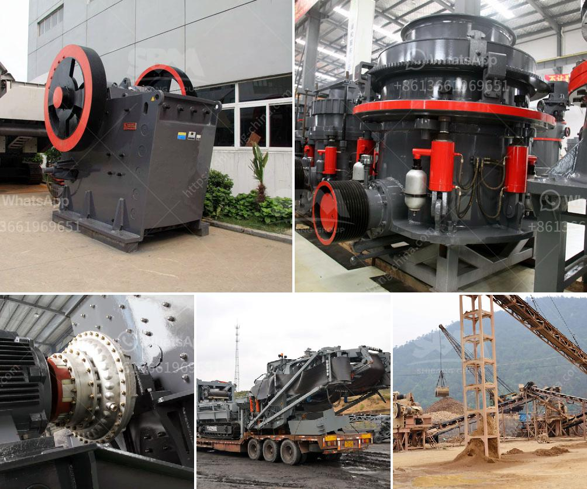

<h3>granite mining equipment</h3>
Granite is an igneous rock composed of mica, feldspar, quartz, and other minerals. It is one of the most commonly used stones in construction, particularly for countertops. As the demand for granite continues to increase, so does the need for granite mining equipment.

Granite mining is a large industrial process which separates the granite from other rocks deep beneath the Earth's surface. The first step in this process is blasting the rock into pieces that can be easily transported and handled. To do this, holes are drilled into the rock and carefully filled with explosives. Once the explosives are detonated, the resulting explosion breaks the granite into smaller fragments.

After the blasting process, the granite pieces are loaded onto trucks or conveyor belts and transported to the primary crusher. The primary crusher reduces the size of the fragmented pieces to a manageable size suitable for the downstream process. Depending on the size of the granite fragments, several crushers may be used to achieve the desired size reduction.

Once the granite pieces have been crushed to the desired size, they are then sent through various stages of processing and refinement. This includes removing any impurities or undesirable materials and shaping the granite into the desired dimensions. To accomplish this, a variety of different granite mining equipment is used.

The equipment used for extracting granite varies depending on the mining method employed. Some methods can be very efficient and cost-effective, while others require substantial investments in machinery and infrastructure. Here are some common types of granite mining equipment:

1. Drilling equipment: Drilling is the most reliable method of extracting granite from the ground. The drilling equipment used in mining granite consists of a highly skilled technician operating a drilling machine capable of drilling holes into the granite bedrock. These holes are then filled with explosives and blasted to create smaller fragments.

2. Diamond wire saws: Diamond wire saws are another commonly used piece of equipment in granite mining. This cutting technique involves the use of a diamond-coated wire to cut through the granite. The wire is threaded through a series of pulleys and guided through the stone by a motor, effectively cutting it into manageable pieces.

3. Excavators: Excavators are heavy machinery used to extract the granite from the ground. They are powerful enough to break through the hard granite bedrock and remove the fragments with precision. Excavators can also be used to load the broken granite onto trucks or conveyor belts for transportation to the processing plant.

4. Water jets: Water jets can be used to cut granite with extreme precision. High-pressure water is forced through a small nozzle, creating a focused jet of water that can cut through the granite without causing any damage to the surrounding areas. Water jets are especially useful when working with delicate or intricate designs.

In conclusion, granite mining requires a wide variety of equipment to successfully extract, process, and shape the stone. It is important to choose the right equipment to ensure cost-efficiency and maximum productivity. With advancements in technology, granite mining equipment has become safer and more environmentally friendly, minimizing the impact on both workers and the environment.
<h3>Contact us</h3><ul><li><strong>Whatsapp:&nbsp;<a href="https://wa.me/8613661969651">+8613661969651</a></strong></li><li><a href="https://swt.shibang-china.com/?git&amp;zhl&amp;granite mining equipment"><strong>Online Service(chat now)</strong></a></li></ul><h3>Related</h3><ul><li><a href='feldspar powder suppliers.md'>feldspar powder suppliers</a></li><li><a href='gypsum powder production plants.md'>gypsum powder production plants</a></li><li><a href='fluorite processing.md'>fluorite processing</a></li><li><a href='how much cost to build a 50 ton cement plant.md'>how much cost to build a 50 ton cement plant</a></li><li><a href='gypsum powder production line factory.md'>gypsum powder production line factory</a></li></ul>