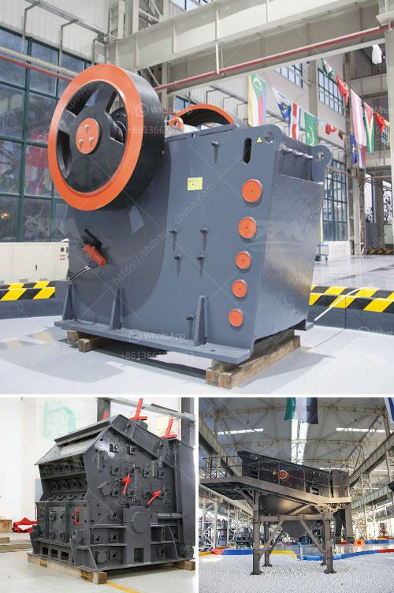

<h3>granite quarry machine</h3>
The granite quarry machine, also known as a wire saw or diamond wire saw, can help extract excellent quality granite blocks from quarries with the least amount of waste and destruction. With these machines, there are no expensive and time-consuming explosives, nor the need for traditional heavy equipment. The diamond wire saw is an eco-friendly alternative that significantly reduces the environmental impact of the quarrying process.

One of the key advantages of the granite quarry machine is its versatility. It is capable of cutting granite as well as other types of stone that have high hardness levels. With a wire saw, consistency in output size and quality across multiple blocks is easily achievable. It has the potential to extract both large and small granite blocks with precision, which is crucial for meeting different customer requirements.

Another major benefit of using a granite quarry machine is its high efficiency. The wire saw allows for faster cutting, reducing valuable quarrying time. It is also relatively easier to operate, making it possible for quarry workers to quickly adapt to the machine. This not only improves productivity but also lowers labor costs for the quarry business.

Moreover, the granite quarry machine boasts remarkable safety features. It minimizes the risks associated with traditional quarrying tools and processes, such as explosions or collapses. The diamond wire saw operates with minimal vibrations and noise, ensuring a safer working environment for the operators.

Additionally, the maintenance and upkeep of a granite quarry machine are relatively simple and cost-effective. Regular maintenance of the cutting wire, pulleys, and tensioning system ensures optimal performance, prolonging the machine's lifespan.

Investing in a granite quarry machine is a wise choice for any quarrying business. It offers a reliable and efficient alternative to traditional quarrying techniques, resulting in higher productivity, a safer work environment, and excellent quality granite blocks. By utilizing this advanced machine, quarry businesses can not only reduce their environmental impact but also enhance their overall profitability and reputation.
<h3>Contact us</h3><ul><li><strong>Whatsapp:&nbsp;<a href="https://wa.me/8613661969651">+8613661969651</a></strong></li><li><a href="https://swt.shibang-china.com/?git&amp;zhl&amp;granite quarry machine"><strong>Online Service(chat now)</strong></a></li></ul><h3>Related</h3><ul><li><a href='mineral processing equipment.md'>mineral processing equipment</a></li><li><a href='calcium carbonate multiplication process.md'>calcium carbonate multiplication process</a></li><li><a href='used metal crushers japan.md'>used metal crushers japan</a></li><li><a href='cost estimates of a chrome processing plant.md'>cost estimates of a chrome processing plant</a></li><li><a href='technical specification belt conveyors.md'>technical specification belt conveyors</a></li></ul>