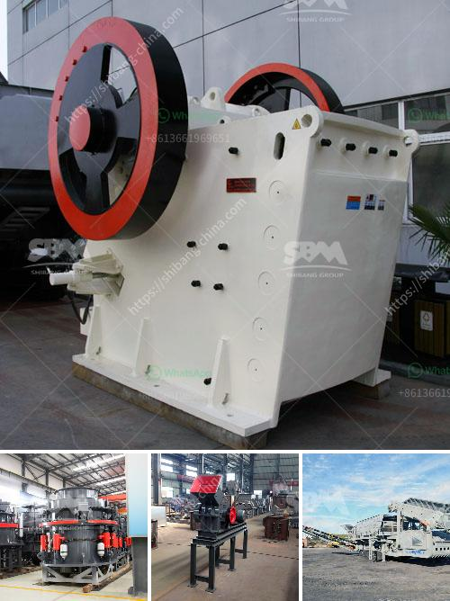

<h3>granite quarry machinery for sale</h3>
Granite is a popular material used for construction purposes due to its durability, beauty, and ability to withstand harsh weather conditions. To extract granite from a quarry, specialized machinery and equipment are required. These machines help facilitate the process and increase efficiency, resulting in cost-effective and high-quality granite products. In this article, we will explore the various granite quarry machinery available for sale and their importance in the granite extraction process.

One of the key machines required in a granite quarry is the diamond wire saw machine. This cutting machinery uses a wire impregnated with diamond beads to slice through the granite blocks. The diamond wire saw machine is highly efficient and effective in extracting granite while minimizing wastage. It is operated by skilled technicians who carefully maneuver the wire to cut through the stone according to desired specifications.

Another essential machine used in granite quarrying is the drilling machine. The drilling machine is used to create holes in the granite for inserting explosives during the blasting process. This machine requires precision and accuracy to ensure the holes are precisely aligned, allowing for effective rock fragmentation. A reliable drilling machine saves time and ensures the smooth progress of the quarrying operation.

To load and transport the extracted granite blocks, heavy-duty wheel loaders and dump trucks are utilized. The wheel loaders are responsible for loading the granite blocks onto the trucks for transportation to processing facilities or customer sites. These loaders are equipped with powerful engines and robust structures to handle the weight of the granite blocks. Dump trucks, on the other hand, are used to transport the loaded granite blocks to their intended destinations safely and efficiently.

Once the granite blocks are extracted and transported, they undergo various processing stages, including cutting, polishing, and shaping. These processes require specialized machinery such as stone cutting machines, bridge saws, and CNC routers. These machines help transform the raw granite into finished products like slabs, tiles, countertops, and monuments, which are in high demand for residential and commercial construction projects.

It is important to mention that investing in high-quality granite quarry machinery is crucial for long-term success and profitability. By purchasing machinery from reputable manufacturers or suppliers, quarry owners can ensure they are getting reliable and durable equipment that will withstand the demanding nature of granite extraction. Regular maintenance and servicing of these machines are also essential to prolong their lifespan and maximize their performance.

In conclusion, the availability of granite quarry machinery for sale plays a crucial role in the granite extraction process. From diamond wire saw machines to drilling machines, wheel loaders, and dump trucks, each piece of equipment contributes to the smooth operation of a granite quarry. Efficient and reliable machines not only increase productivity but also ensure the production of high-quality granite products. Therefore, investing in the right machinery is essential for any granite quarry owner looking to thrive in the construction industry.
<h3>Contact us</h3><ul><li><strong>Whatsapp:&nbsp;<a href="https://wa.me/8613661969651">+8613661969651</a></strong></li><li><a href="https://swt.shibang-china.com/?git&amp;zhl&amp;granite quarry machinery for sale"><strong>Online Service(chat now)</strong></a></li></ul><h3>Related</h3><ul><li><a href='grinding plant supplier.md'>grinding plant supplier</a></li><li><a href='cement plant layout consultants in south kolkata.md'>cement plant layout consultants in south kolkata</a></li><li><a href='used grinding mills in nigeria.md'>used grinding mills in nigeria</a></li><li><a href='how to make a roller mill.md'>how to make a roller mill</a></li><li><a href='labratory hammer mill.md'>labratory hammer mill</a></li></ul>