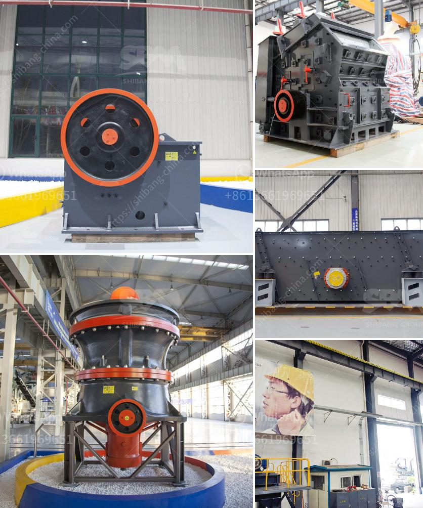

<h3>granite stone crusher india</h3>
India is rich in various mineral resources and it is an important mineral processing market. With the development of local economy, lots of mineral processing plants are built there. SBM has built our oversea office in India for many years and we have numerous customers there, the market is quite mature.

Many clients from India have bought the granite stone crusher machines from SBM. As a leading manufacturer of mining equipment, SBM can provide a full range of mining equipment, including crushing, grinding, beneficiation, and processing. Our granite stone crushers in India have been exported to more than 130 countries, India, South Africa, Indonesia, Nigeria, Saudi Arabia, Algeria, Peru, Brazil, and many other countries.

If you want to get the high quality granite aggregate and sand, you should choose SBM as your application consultant. SBM granite stone crushers feature high production capacity, low power consumption, easy operation and maintenance, and low operating cost. It is widely used in various applications, such as mining, building materials, highway, railway, water conservancy and chemical industries.

SBM's granite stone crusher equipment provides a high quality and low price crushing plant for granite quarry equipment rental. We use our professional knowledge and advanced technology to design and create innovative solutions to meet our customers' needs and deliver long-term and reliable products and services.

SBM is a professional manufacturer of granite crusher, which provides all kinds of granite crusher equipment used in granite production line, including jaw crusher, cone crusher, impact crusher, vibrating screen and belt conveyor. SBM granite crusher has the features of high automation, high crushing ratio, low operating cost, energy saving and environmental protection.

SBM is a trusted and reliable brand for its high-quality and good manufacturing. It specializes in producing jaw crusher, which is widely used in mining, quarry, material handling. Our company has been a manufacturer and exporter of the crushers for decades. Over these years, our company has gathered specialists and experience in designing and manufacturing various models of jaw crushers. By constant research, we have developed a series of high-performance products, such as PE series jaw crusher, PEW series jaw crusher, HJ series jaw crusher, etc. Based on years' experience and technology development, SBM jaw crusher series are of different models, which can meet most crushing requirements in primary and secondary crushing.

The granite stone crusher India is divided into three stages: primary crushing, secondary crushing, and tertiary crushing. There are different models in these types of SBM's granite stone crusher machines, such as PE, PEW series jaw crusher, PF series impact crusher, PFW series impact crusher, CS series cone crusher and so on. Depending on the classification and application requirements, clients can choose different kinds of granite stone crusher machines to meet their specific production requirements.

It is advantageous if the crushed stone unit is set up near the quarries where the granite boulders of various sizes are available for the crushing unit. The wastage from the granite industry will be of much use to the crushed stone unit. Stone crushing plant for the crushing production line SBM manufactures various equipments for whole set of stone crushing production line, and provides superior technical assistance for customers. The whole set stone crushing plant consists of vibrating feeder, jaw crusher, impact crusher, vibrating screen, and belt conveyor. According to specific requirements, we can combine different models together to meet various needs.

In conclusion, granite stone crusher machines have a lot of different types such as PE series jaw crusher, PEW series jaw crusher, PF series impact crusher, PFW series impact crusher, CS series cone crusher as well as some other types. All of these crushers are specific to the granite material. In order to further improve the production efficiency, reduce the waste rate, and save energy, these crushers have been extensively used in granite processing plants. SBM crushing equipment is designed to achieve maximum productivity and high reduction ratio. So if you want to, you can choose SBM granite stone crusher and you will be happy with its excellent performance and durability.
<h3>Contact us</h3><ul><li><strong>Whatsapp:&nbsp;<a href="https://wa.me/8613661969651">+8613661969651</a></strong></li><li><a href="https://swt.shibang-china.com/?git&amp;zhl&amp;granite stone crusher india"><strong>Online Service(chat now)</strong></a></li></ul><h3>Related</h3><ul><li><a href='out used stone crusher in america.md'>out used stone crusher in america</a></li><li><a href='rock crusher equipment.md'>rock crusher equipment</a></li><li><a href='price of a stone crusher machine in zambia.md'>price of a stone crusher machine in zambia</a></li><li><a href='fairly used stone crusher for sale nigeria.md'>fairly used stone crusher for sale nigeria</a></li><li><a href='were to buy old rock crusher.md'>were to buy old rock crusher</a></li></ul>