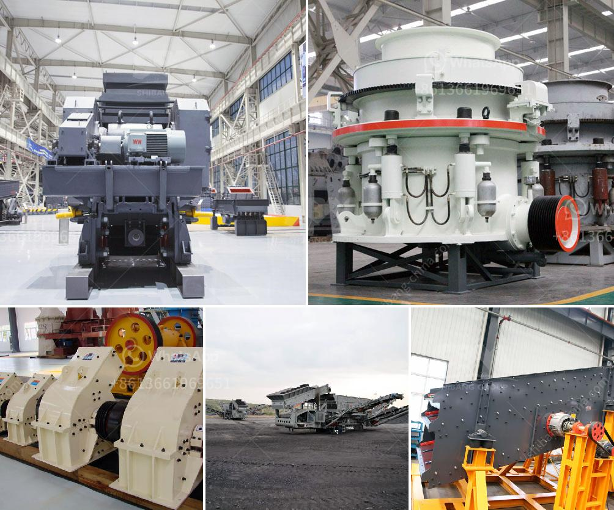

<h3>granite stone processing plant</h3>
Granite stone, a common and widely occurring type of intrusive, felsic, igneous rock, is found in every corner of the planet. Used mainly for construction purposes, granite is a versatile and durable material that adds elegance and beauty to any structure. To meet the rising demand for granite, there are numerous granite stone processing plants worldwide that extract, cut, polish, and package this natural resource for commercial use.

Granite stone processing plants are typically established near the quarries where the granite is extracted. This allows them to efficiently process the raw material while minimizing transportation costs. These plants are equipped with state-of-the-art machinery and advanced technology to ensure precise cutting and minimal waste. Let's take a closer look at the steps involved in the granite stone processing plant.

The first step in the granite stone processing plant is the extraction of granite blocks from the quarries. The blocks are usually removed using diamond wire saws or hydraulic splitters. Once the blocks are removed, they are transported to the processing plant either by truck or rail.

At the processing plant, the blocks are first cut into slabs using large diamond saws. These saws have diamond-tipped blades that can cut through granite with ease. The slabs are then sent to the polishing section, where they are polished to achieve the desired finish. Polishing can be done using different techniques, such as abrasives, resin pads, or diamond polishing heads, depending on the required smoothness and shine.

After polishing, the slabs are inspected for any imperfections or defects. If any flaws are found, they are corrected using epoxy resins or fillers. Once the slabs pass the quality control check, they are ready for packing and transportation to the customers.

Granite stone processing plants also produce a wide range of other granite products, such as tiles, countertops, and monuments. These products are made from the smaller pieces of granite that are left after cutting the slabs. The smaller pieces are shaped, polished, and then used for various applications in construction, interior design, and landscaping.

In addition to its aesthetic appeal, granite stone is valued for its durability and resistance to heat, scratches, and stains. It is widely used in kitchens, bathrooms, and other high-traffic areas due to its ability to withstand heavy use and maintain its beauty for years.

With the increasing use of granite in modern construction and design, granite stone processing plants play a crucial role in meeting the demand for this versatile material. These plants combine technology, craftsmanship, and expertise to transform rough, raw granite blocks into stunning finished products that enhance the beauty of our surroundings.

In conclusion, granite stone processing plants are at the forefront of transforming this natural resource into various functional and visually appealing products. Through the extraction, cutting, polishing, and packaging processes, granite stone is transformed into slabs, tiles, countertops, and monuments that add elegance and durability to homes, buildings, and landscapes worldwide. With their advanced technology and attention to detail, these plants ensure that the beauty and durability of granite stone are accessible to everyone.
<h3>Contact us</h3><ul><li><strong>Whatsapp:&nbsp;<a href="https://wa.me/8613661969651">+8613661969651</a></strong></li><li><a href="https://swt.shibang-china.com/?git&amp;zhl&amp;granite stone processing plant"><strong>Online Service(chat now)</strong></a></li></ul><h3>Related</h3><ul><li><a href='concrete crushers for rent.md'>concrete crushers for rent</a></li><li><a href='sand sieve machine philippines.md'>sand sieve machine philippines</a></li><li><a href='business proposal for stone crushing plant.md'>business proposal for stone crushing plant</a></li><li><a href='barite crusher plant.md'>barite crusher plant</a></li><li><a href='small stone crushing business in south africa.md'>small stone crushing business in south africa</a></li></ul>