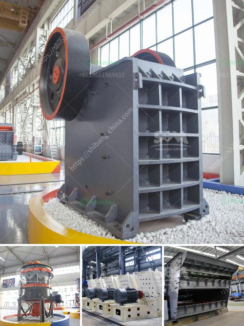

<h3>graphite beneficiation plant at nigeria</h3>
Graphite is an important industrial mineral used in many applications, including lubricants, batteries, and refractories. Nigeria has abundant graphite deposits in various parts of the country, which have not been fully exploited due to the lack of a suitable beneficiation process.

A graphite beneficiation plant at Nigeria’s Nassarawa state would cater to the country’s various industries that require graphite in their operations. This investment opportunity in Nigeria is available for both local and foreign investors to exploit the abundant graphite resources in the country.

The beneficiation plant would be located near the graphite deposits to minimize transportation costs and facilitate easy access to raw materials. The plant would initially process raw graphite ore into concentrate, which would then be used to manufacture various graphite products. This would include high-quality graphite for the lubricant industry, graphite electrodes for batteries, and graphite powders for refractories.

Furthermore, the beneficiation plant would have the capability to produce different grades of graphite concentrate, depending on the specific requirements of different industries. This flexibility would enable the plant to cater to a wide range of customers and maximize its revenue potential.

In addition to the economic benefits, the establishment of a graphite beneficiation plant in Nigeria would also create employment opportunities for the local population. Skilled and semi-skilled workers would be required to operate and maintain the plant, contributing to the socio-economic development of the region.

The graphite beneficiation plant would also contribute to environmental sustainability. The by-products generated during the beneficiation process, such as tailings and waste rock, can be utilized in various applications, including road construction and cement production. This would reduce the environmental impact of mining activities and promote the efficient use of resources.

Overall, the establishment of a graphite beneficiation plant in Nigeria would enhance the country’s industrial capabilities and boost economic growth. It would leverage Nigeria's abundant graphite resources and create value-added products for both domestic consumption and export. This investment opportunity presents a win-win scenario for investors and the Nigerian economy.
<h3>Contact us</h3><ul><li><strong>Whatsapp:&nbsp;<a href="https://wa.me/8613661969651">+8613661969651</a></strong></li><li><a href="https://swt.shibang-china.com/?git&amp;zhl&amp;graphite beneficiation plant at nigeria"><strong>Online Service(chat now)</strong></a></li></ul><h3>Related</h3><ul><li><a href='high energy ball mill india.md'>high energy ball mill india</a></li><li><a href='clay brick making equipment south africa.md'>clay brick making equipment south africa</a></li><li><a href='used crusher price in uk.md'>used crusher price in uk</a></li><li><a href='coal washing process machine price.md'>coal washing process machine price</a></li><li><a href='conveyor belt supplier in shanghai china.md'>conveyor belt supplier in shanghai china</a></li></ul>