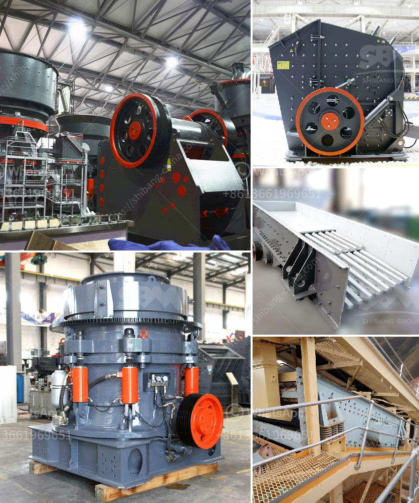

<h3>graphite manufacturing plant</h3>
Graphite is a highly versatile material that has found numerous applications in various industries, from aerospace to electronics and renewable energy. With its unique properties, such as high thermal and electrical conductivity, and excellent lubricity, the demand for graphite has been on the rise. To meet this growing demand, the establishment of graphite manufacturing plants has become essential.

A graphite manufacturing plant is a facility equipped with advanced machinery and technology to produce high-quality graphite products. From graphite electrodes used in steel making to lithium-ion batteries, these plants play a crucial role in transforming raw graphite into value-added products. The process involves several stages, including graphite beneficiation, flake graphite production, purification, and shaping.

One of the primary advantages of a graphite manufacturing plant is its ability to produce custom-designed graphite products. By tailoring the manufacturing process to meet specific requirements, these plants can cater to a wide range of industries. For instance, in the aerospace industry, graphite is used to make lightweight components for aircraft, while in the electronics industry, it is used as a heat sink in high-power electronic devices.

Furthermore, graphite manufacturing plants focus on sustainable practices to reduce their environmental impact. They employ advanced filtration systems to capture and recycle emissions, reducing greenhouse gas emissions. Additionally, innovative water treatment processes minimize water consumption, preserving this valuable resource.

The future of graphite manufacturing plants looks promising, especially with the increasing focus on renewable energy sources. Graphite plays a vital role in energy storage systems, particularly in lithium-ion batteries used in electric vehicles and renewable energy storage. As the demand for electric vehicles and renewable energy systems continues to grow, the need for graphite manufacturing plants will intensify.

In conclusion, a graphite manufacturing plant is a crucial player in supplying high-quality graphite products to various industries. Its ability to customize production, focus on sustainability, and meet the increasing demand for advanced materials makes it an essential part of the modern manufacturing landscape. As technology advances and new applications for graphite emerge, these plants will continue to revolutionize the future, driving innovation and ushering in a new era of possibilities.
<h3>Contact us</h3><ul><li><strong>Whatsapp:&nbsp;<a href="https://wa.me/8613661969651">+8613661969651</a></strong></li><li><a href="https://swt.shibang-china.com/?git&amp;zhl&amp;graphite manufacturing plant"><strong>Online Service(chat now)</strong></a></li></ul><h3>Related</h3><ul><li><a href='grinding mill machine gebraucht.md'>grinding mill machine gebraucht</a></li><li><a href='industrial vibrator feeders.md'>industrial vibrator feeders</a></li><li><a href='iron slag buyers in punjab india.md'>iron slag buyers in punjab india</a></li><li><a href='coal crusher 10mm.md'>coal crusher 10mm</a></li><li><a href='stoner cusher price in kenya.md'>stoner cusher price in kenya</a></li></ul>