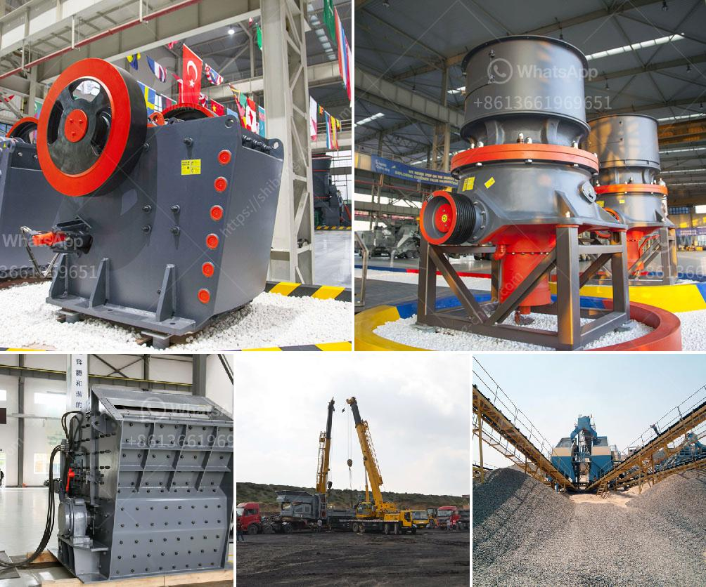

<h3>graphite mining equipment in madagascar suppliers</h3>
Graphite mining plays a crucial role in the development and advancement of renewable technologies such as electric vehicles, lithium-ion batteries, and solar power systems. As the world strives to reduce its carbon footprint, the demand for graphite is poised to skyrocket in the coming decades. Madagascar, rich in graphite deposits, has become a significant player in the global graphite mining industry. This article will explore the suppliers of graphite mining equipment in Madagascar.

Madagascar is renowned for its high-quality graphite deposits, particularly in the eastern region of the country. The graphite found in Madagascar is known for its high purity and exceptional flake size. Several mining companies have established operations in the country to extract and process graphite for international markets.

One of the leading suppliers of graphite mining equipment in Madagascar is DPMG (Dynamic Professional Mining Group). The company focuses on delivering high-quality and sustainable mining solutions in line with global environmental standards. DPMG offers a range of mining equipment, including crushers, mills, screens, and flotation cells, specifically designed for graphite extraction and processing.

Another prominent supplier in Madagascar is FLSmidth, an international engineering company specializing in minerals processing and cement production. FLSmidth offers a comprehensive range of graphite mining equipment, from crushers and mills to flotation cells and magnetic separators. The company's equipment is known for its robustness, efficiency, and sustainability.

Metso Outotec, a global leader in minerals and metals processing technology, is also a reliable supplier of graphite mining equipment in Madagascar. The company provides high-quality solutions for graphite crushing, grinding, flotation, and dewatering processes. Metso Outotec's equipment is designed to optimize graphite recovery while minimizing environmental impact.

When it comes to graphite mining equipment, it is crucial to consider suppliers that prioritize sustainability and environmental responsibility. Many mining companies in Madagascar have adopted environmentally friendly practices to mitigate their ecological footprint. This includes efficient water management systems, energy-saving technologies, and responsible waste disposal.

In addition to equipment suppliers, Madagascar also offers a skilled workforce for graphite mining operations. The country has a long history of mining, and its labor force is well-trained and experienced in the extraction and processing of minerals. Many mining companies in Madagascar invest in training and developing local talent to build a sustainable and prosperous mining industry.

It is worth mentioning that graphite mining in Madagascar has faced some challenges in recent years, including political instability and lack of infrastructure. However, the government has taken several measures to attract foreign investments and boost the mining sector. This includes improving transportation networks, streamlining permit processes, and establishing clear regulatory frameworks.

In conclusion, graphite mining equipment suppliers in Madagascar play a vital role in meeting the increasing global demand for graphite. These suppliers offer a range of high-quality and sustainable equipment designed for efficient graphite extraction and processing. With the country's rich graphite deposits and skilled labor force, Madagascar has the potential to become a significant player in the global graphite mining industry.
<h3>Contact us</h3><ul><li><strong>Whatsapp:&nbsp;<a href="https://wa.me/8613661969651">+8613661969651</a></strong></li><li><a href="https://swt.shibang-china.com/?git&amp;zhl&amp;graphite mining equipment in madagascar suppliers"><strong>Online Service(chat now)</strong></a></li></ul><h3>Related</h3><ul><li><a href='how much cost to build a 50 ton cement plant.md'>how much cost to build a 50 ton cement plant</a></li><li><a href='rock grinding equipment for sale in texas.md'>rock grinding equipment for sale in texas</a></li><li><a href='india grinding machine for talcum powder.md'>india grinding machine for talcum powder</a></li><li><a href='cost of setting up a limestone processing unit.md'>cost of setting up a limestone processing unit</a></li><li><a href='plant crushing materials in antioquia.md'>plant crushing materials in antioquia</a></li></ul>