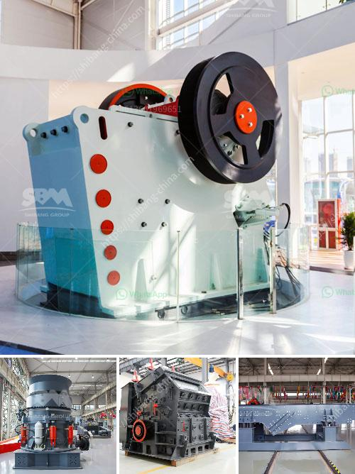

<h3>graphite mining india</h3>
India is one of the major graphite producers in the world, contributing approximately 7% of the global production. It is also home to one of the largest graphite reserves, located in the state of Jharkhand. Graphite mining in India has gained significant attention due to its crucial role in various industries such as electronics, batteries, and lubricants. However, this mining activity has raised environmental concerns that need to be addressed for sustainable development.

Graphite is a naturally occurring form of carbon with unique properties, including excellent thermal and electrical conductivity, high tensile strength, and lubricating capabilities. These characteristics make it a valuable resource in the manufacturing of electric vehicle (EV) batteries, solar panels, and electric conductors, among others. As the demand for these products continues to rise, the need for graphite mining and production becomes even more critical.

India's graphite reserves are mainly found in the states of Jharkhand, Tamil Nadu, and Odisha. Jharkhand alone accounts for over 50% of the country's graphite production. The extraction of graphite involves both open-pit and underground mining methods, depending on the depth and quality of the deposits. Open-pit mining is the most common method in India, where mechanized equipment such as excavators and trucks are used to remove the overburden and extract the graphite ore.

While graphite mining brings economic benefits to the region, it also poses significant environmental challenges. One of the major concerns is the disposal of mine waste, which often contains high levels of toxic substances such as heavy metals and sulfur. Improper waste management can lead to water pollution, soil degradation, and damage to local ecosystems.

Another environmental issue associated with graphite mining is the potential impact on air quality. The extraction and processing of graphite involve the release of dust particles, which can contain harmful compounds like silica. Prolonged exposure to silica dust can lead to respiratory issues and other health hazards for both miners and nearby communities.

To mitigate these environmental concerns, strict regulations and monitoring programs need to be implemented in graphite mining operations. The focus should be on improving waste management practices, including proper containment and treatment of mine tailings. Implementing dust control measures, such as wet drilling and the use of dust suppression systems, can help reduce air pollution.

Furthermore, sustainable mining practices, such as reclamation and rehabilitation of mined-out areas, need to be prioritized. By restoring the land and reintroducing vegetation, the ecological balance can be maintained and the impact on local biodiversity minimized.

Graphite mining in India holds tremendous potential for economic growth and technological advancement. However, it is essential to ensure that the benefits are balanced with environmental preservation. The Indian government, in collaboration with the mining industry and environmental organizations, should work towards developing comprehensive policies and practices to safeguard the environment while harnessing the full potential of this vital natural resource.

In conclusion, graphite mining in India plays a crucial role in various industries and contributes significantly to the country's economy. Nevertheless, the environmental concerns associated with this mining activity cannot be ignored. Adopting sustainable practices, improving waste management, and implementing stringent regulations are necessary steps towards achieving a balance between economic development and environmental preservation in the graphite mining sector.
<h3>Contact us</h3><ul><li><strong>Whatsapp:&nbsp;<a href="https://wa.me/8613661969651">+8613661969651</a></strong></li><li><a href="https://swt.shibang-china.com/?git&amp;zhl&amp;graphite mining india"><strong>Online Service(chat now)</strong></a></li></ul><h3>Related</h3><ul><li><a href='portable crushing machine from spain.md'>portable crushing machine from spain</a></li><li><a href='screen and crusher hire.md'>screen and crusher hire</a></li><li><a href='coal washing plant for sale grinding mill china.md'>coal washing plant for sale grinding mill china</a></li><li><a href='working principle of ball mill pdf.md'>working principle of ball mill pdf</a></li><li><a href='ore processing plant for sale.md'>ore processing plant for sale</a></li></ul>