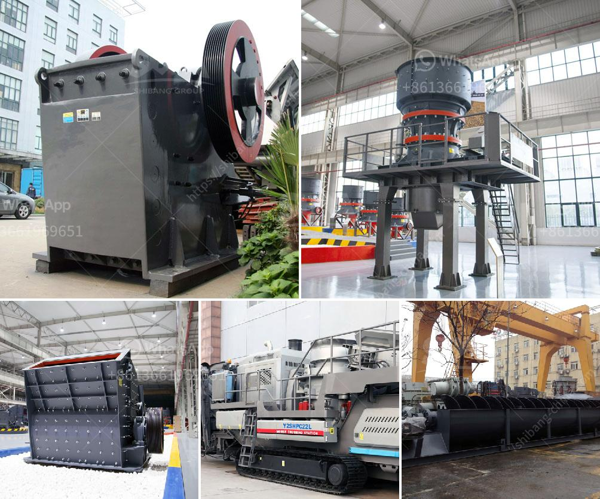

<h3>gravel crusher machine philippines</h3>
A gravel crusher is one of the most important pieces of equipment when you work in the mining industry. The crusher can crush a variety of materials, including materials that are very hard. This machine is widely used in processing stones in mining or in infrastructure development projects. The stone-crusher machine relies on dodge and blake to destroy the rock.

Jaw crusher is one of the most popular stone crushing machines used in the world. Jaw Crusher is an ideal stone crusher machine and can destroy stones well. Jaw Crusher has a very high pressure so it can destroy very hard stones. Jaw Crusher has many advantages so it is widely used in the construction and mining process.

In the Philippines, there are many options for customers like you that want to buy a stone crusher machine. Some of them are 100-150 TPH, 150-180 TPH, 200-250 TPH, 300-350 TPH, 500-600 TPH, 600-800 TPH, 800-1000 TPH, etc. The configuration and price of the machines vary depending on the manufacturer and required capacity.

You can buy these machines at any local or online store. Most local stores offer free shipping and have a great after-sales service. After confirming the specific project requirements, local stores can deliver the machine within a few days. Online stores usually take a bit longer but offer a wider range of options from different manufacturers.

Crusher machines are becoming more and more advanced. Nanotechnology is used in the manufacturing of the crushers, resulting in better performance and efficiency. Whatever your quarrying needs are, a gravel crusher machine is the perfect choice for any business owner.

In conclusion, purchasing a gravel crusher machine in the Philippines is beneficial for both small and large-scale industries. To ensure that you invest in a high-quality machine, it is essential to look for a reliable and reputable supplier in the Philippines.
<h3>Contact us</h3><ul><li><strong>Whatsapp:&nbsp;<a href="https://wa.me/8613661969651">+8613661969651</a></strong></li><li><a href="https://swt.shibang-china.com/?git&amp;zhl&amp;gravel crusher machine philippines"><strong>Online Service(chat now)</strong></a></li></ul><h3>Related</h3><ul><li><a href='mining equipments in japan.md'>mining equipments in japan</a></li><li><a href='dolomite lime process for agriculure.md'>dolomite lime process for agriculure</a></li><li><a href='india grinding machine for talcum powder.md'>india grinding machine for talcum powder</a></li><li><a href='stone crusher plant in turkey.md'>stone crusher plant in turkey</a></li><li><a href='lime stone crusher spesifikasi.md'>lime stone crusher spesifikasi</a></li></ul>