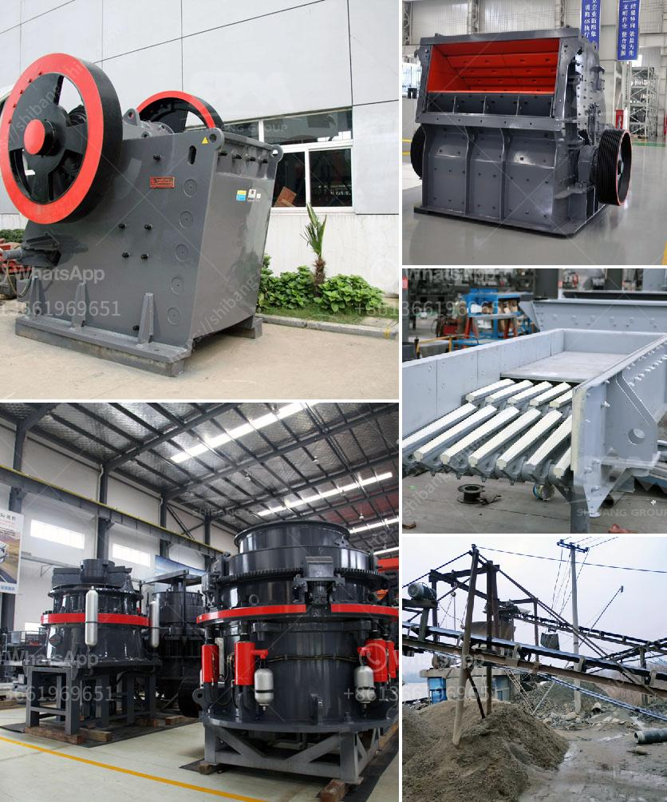

<h3>gravel crushers for sale in</h3>
In the mining industry, gravel crushers are essential pieces of equipment that help to break down hard rocks into smaller, more manageable sizes. These crushers are instrumental in increasing productivity and reducing the overall cost of material processing. Whether you are a small-scale contractor or a large mining company, finding the right gravel crushers for sale is crucial to ensure efficient and effective operations.

Gravel crushers come in various sizes and configurations, but they all work in the same principle. They utilize a powerful motor, along with a set of jaws or hammers, to crush the rocks into smaller pieces. These pieces can then be further processed or used as they are for construction purposes.

When searching for gravel crushers for sale, there are a few factors to consider. First and foremost, it is important to evaluate the type of material you are working with and the specific requirements of your project. Some crushers are better suited for soft materials, while others are designed for harder rocks. Understanding your needs will help you make an informed decision.

Another crucial factor to consider when purchasing gravel crushers is the capacity requirement. The capacity of the crusher determines how much material it can process within a given timeframe. If you have large quantities of material that need to be crushed, opting for a high-capacity crusher is essential to avoid delays and bottlenecks in your operations.

Additionally, it is essential to consider the durability and reliability of the crushers you are considering. Gravel crushers are subjected to harsh working conditions, and it is essential to invest in machines that can withstand these conditions and offer long-lasting performance. Look for crushers made of high-quality materials and those that are backed by a reputable manufacturer.

Finally, budgetary considerations play a crucial role in finding the right gravel crushers for sale. It is important to strike a balance between quality and affordability. While you don't want to compromise on the quality of the equipment, it is also essential to find the best value for your money. Consider your budget and explore different options to find a crusher that meets your requirements and falls within your price range.

In conclusion, gravel crushers are indispensable tools in the mining industry, allowing for the efficient processing of materials and construction projects. When searching for gravel crushers for sale, remember to consider factors such as the type of material, capacity requirement, durability, and budget. With the right crusher, you can enhance productivity, reduce costs, and make the most of your mining or construction operations.
<h3>Contact us</h3><ul><li><strong>Whatsapp:&nbsp;<a href="https://wa.me/8613661969651">+8613661969651</a></strong></li><li><a href="https://swt.shibang-china.com/?git&amp;zhl&amp;gravel crushers for sale in"><strong>Online Service(chat now)</strong></a></li></ul><h3>Related</h3><ul><li><a href='the price of a ball mill in india.md'>the price of a ball mill in india</a></li><li><a href='small stone crushers.md'>small stone crushers</a></li><li><a href='how to make a roller mill.md'>how to make a roller mill</a></li><li><a href='mineral processing equipment cost.md'>mineral processing equipment cost</a></li><li><a href='small scale gold ball mill.md'>small scale gold ball mill</a></li></ul>