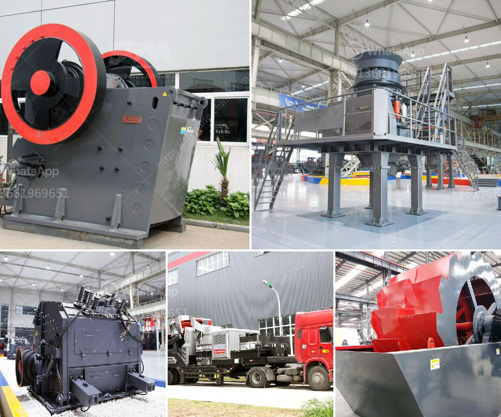

<h3>gravel crushing plant</h3>
A gravel crushing plant is a commonly used piece of equipment in gravel production, crushing rocks to get a specific size range of gravel particles.

The plant can be divided into two major sections, which are the feeder and the crusher. The feeder feeds the raw materials into the crusher, while the crusher is responsible for reducing the size of the material to get the desired gravel size range.

In a gravel crushing plant, there are several types of crushers that are used to crush the rocks into gravel. Jaw crushers are used for primary crushing, and impact crushers or cone crushers are used for secondary crushing. These crushers break the rocks into smaller sizes by crushing them against a hard surface.

The gravel crushing plant usually includes several conveyors to transport the crushed materials to the next stage of the production process. The conveyors can be stationary or mobile, depending on the layout of the plant and the location of the gravel source. They transfer the materials efficiently and continuously, reducing the need for manual handling.

The size of the gravel produced by the crushing plant can be controlled by adjusting the gap between the crusher's impact plates or the cone crusher's mantle and concave. This allows the operator to achieve the desired size range of gravel particles, ensuring that the final product meets the requirements of the project or customer.

Additionally, a vibrating screen is often used in the gravel crushing plant to separate the crushed materials into different sizes. The screen allows the smaller-sized gravel to fall through while retaining the larger-sized particles for further processing. This helps to ensure the quality of the final product.

In terms of maintenance, a gravel crushing plant requires regular inspections and maintenance to ensure its efficient and reliable operation. This includes checking the wear parts of the crusher, such as the impact plates and cone crusher mantle, and replacing them when necessary. It is crucial to keep the plant clean from dust and debris, as this can affect its performance and longevity.

A gravel crushing plant plays a crucial role in the production of gravel for various applications, such as construction, road building, and landscaping. It provides an efficient and cost-effective way to process gravel, helping to meet the demand for this versatile material.

In conclusion, a gravel crushing plant is a vital piece of equipment in gravel production, allowing for the efficient crushing of rocks into gravel particles of the desired size range. With the right maintenance and care, it can provide a reliable and long-lasting solution for gravel production needs.
<h3>Contact us</h3><ul><li><strong>Whatsapp:&nbsp;<a href="https://wa.me/8613661969651">+8613661969651</a></strong></li><li><a href="https://swt.shibang-china.com/?git&amp;zhl&amp;gravel crushing plant"><strong>Online Service(chat now)</strong></a></li></ul><h3>Related</h3><ul><li><a href='mobile crushing machine for sale.md'>mobile crushing machine for sale</a></li><li><a href='crushing roller mill japan.md'>crushing roller mill japan</a></li><li><a href='industrial micronized powder grinding mill.md'>industrial micronized powder grinding mill</a></li><li><a href='ball mill grinding and particle.md'>ball mill grinding and particle</a></li><li><a href='lime stone crusher plant.md'>lime stone crusher plant</a></li></ul>