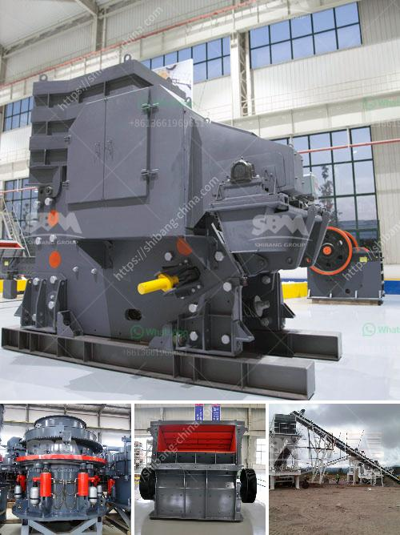

<h3>gravel wash plant for sale</h3>
If you are in the construction industry, you are well aware of the importance of high-quality aggregates for your projects. Gravel is a versatile material used in various applications, including road construction, building foundations, concrete production, landscaping, and many more. To ensure that you have a steady supply of clean and properly graded gravel, investing in a gravel wash plant for sale is a wise decision.

A gravel wash plant is an important piece of equipment that removes unwanted sediments and impurities from the material, resulting in clean and usable gravel. It consists of multiple components, including a vibrating feeder, screening machine, dewatering screen, and a sand washer.

The first step in the process is the feeding of raw gravel into the vibrating feeder. This feeder evenly distributes the gravel onto the screening machine, which efficiently separates the material into different sizes. The screened gravel then passes through the dewatering screen, where excess moisture is removed.

The dewatered gravel is ready for its final step, the sand washing process. The sand washer uses water to clean and separate fine particles from the gravel, ensuring that the final product meets the required specifications. This process effectively removes any organic matter, clay, or other contaminants that may be present in the initial material.

Investing in a gravel wash plant offers several advantages. Firstly, it allows you to consistently produce high-quality gravel that meets industry standards. Clean and properly graded gravel enhances the durability and strength of your construction projects, ensuring long-lasting results.

Secondly, a wash plant improves the efficiency of your operations. By removing the need for manual cleaning, you can significantly reduce labor costs and increase overall productivity. The automated process of a gravel wash plant saves time and resources, enabling you to focus on other aspects of your construction projects.

Additionally, a gravel wash plant promotes environmental sustainability. The removal of contaminants and sediments from the material prevents pollution of nearby water bodies. Moreover, the water used in the washing process can be recycled and reused, reducing water consumption and minimizing your environmental footprint.

When searching for a gravel wash plant for sale, it is important to consider the specific requirements and capacity of your operations. There are various models and sizes available in the market, catering to different needs. Factors such as feed size, output capacity, and maintenance requirements should be assessed to ensure that you select the right equipment for your projects.

Before finalizing your purchase, it is recommended to choose a reputable supplier known for delivering reliable and durable machinery. A well-established supplier will offer maintenance and technical support services, ensuring that your wash plant operates efficiently for years to come.

In conclusion, a gravel wash plant is an essential investment for any construction company aiming to consistently produce high-quality aggregates. The efficient and automated process of a wash plant enhances productivity and reduces labor costs. Moreover, it promotes environmental sustainability by removing contaminants and allowing for water recycling. By choosing a reputed supplier and assessing your specific requirements, you can find the ideal gravel wash plant that meets your needs and boosts the success of your construction projects.
<h3>Contact us</h3><ul><li><strong>Whatsapp:&nbsp;<a href="https://wa.me/8613661969651">+8613661969651</a></strong></li><li><a href="https://swt.shibang-china.com/?git&amp;zhl&amp;gravel wash plant for sale"><strong>Online Service(chat now)</strong></a></li></ul><h3>Related</h3><ul><li><a href='calcite grinding plant.md'>calcite grinding plant</a></li><li><a href='lime stone crusher plant.md'>lime stone crusher plant</a></li><li><a href='vsi crusher plants in uae.md'>vsi crusher plants in uae</a></li><li><a href='vertical vertical raw mill.md'>vertical vertical raw mill</a></li><li><a href='mining vibrating screen for sale.md'>mining vibrating screen for sale</a></li></ul>