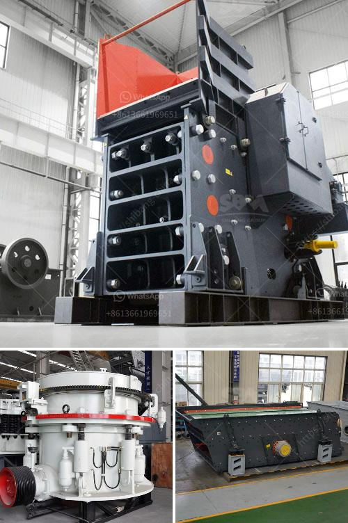

<h3>grind limestone to 60 mesh</h3>
Grinding limestone to 60 mesh is a common practice in the field of agriculture. This particulate size is typically required for various uses such as soil conditioning, animal feed supplements, and fertilizers. The process of grinding involves crushing and pulverizing the limestone into a fine powder, which is then sieved to achieve the desired particle size.

Limestone, a sedimentary rock composed mostly of calcium carbonate, is a widely available and affordable mineral resource. Its application in agriculture helps replenish essential nutrients in the soil and correct pH imbalances. By grinding limestone to 60 mesh, it becomes easier to distribute and mix with other components to create custom-tailored products that best suit specific agricultural needs.

To achieve the desired particle size, specialized equipment such as a pulverizer or a hammer mill is used. These machines contain rotating hammers or blades that impact against the limestone, reducing it to a fine powder. The powder is then passed through a series of mesh screens, with 60 mesh being the typical final size required.

Various benefits are associated with grinding limestone to 60 mesh. Firstly, this fine powder form allows the limestone to dissolve rapidly in the soil, ensuring efficient nutrient absorption by plants. Additionally, the increased surface area resulting from grinding increases the limestone's reactivity, making it more effective in adjusting soil acidity.

Furthermore, grinding limestone to 60 mesh enhances its utility as animal feed supplements. By having a finely ground product, animals can easily digest and absorb the calcium and other essential minerals present in limestone. It also aids in improving bone and shell development, promoting healthier growth in livestock.

In conclusion, grinding limestone to 60 mesh is a crucial step in preparing it for various agricultural applications. This finely ground product incorporates essential minerals and nutrients into the soil, improving its productivity. Whether used as soil conditioning agents, animal feed supplements, or fertilizers, the proper grinding processes ensure that limestone effectively contributes to a sustainable and healthier agricultural industry.
<h3>Contact us</h3><ul><li><strong>Whatsapp:&nbsp;<a href="https://wa.me/8613661969651">+8613661969651</a></strong></li><li><a href="https://swt.shibang-china.com/?git&amp;zhl&amp;grind limestone to 60 mesh"><strong>Online Service(chat now)</strong></a></li></ul><h3>Related</h3><ul><li><a href='granite mining equipment.md'>granite mining equipment</a></li><li><a href='gypsum board manufacturing machines prices inindia.md'>gypsum board manufacturing machines prices inindia</a></li><li><a href='sizing jaw crusher.md'>sizing jaw crusher</a></li><li><a href='gypsum factory machines in india.md'>gypsum factory machines in india</a></li><li><a href='demand of stage concassage mobile.md'>demand of stage concassage mobile</a></li></ul>