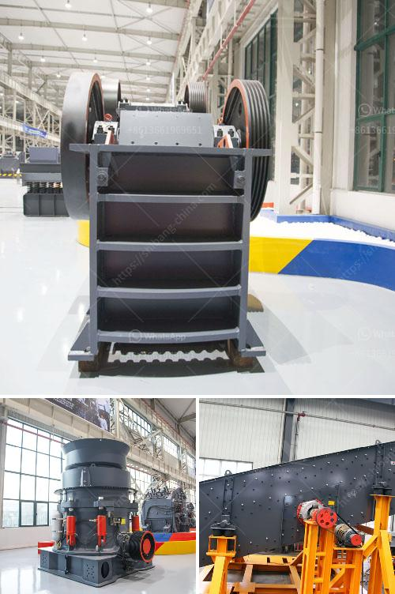

<h3>grinding coal mill</h3>
Coal is a vital resource for power generation worldwide, and the utility industry relies on the efficient grinding of coal for proper combustion. Many power plants around the world still use coal as the main fuel source for producing electricity, despite the increasing contribution from renewable energy sources. Grinding coal mills play a crucial role in fuel preparation and are essential for the reliable and safe operation of power plants.

The coal mill, also known as a pulverizer, grinds the coal into fine particles by rotating a cylindrical steel drum filled with steel balls or rods. As the coal passes through the drum, the impact of the balls crushes and grinds the coal. The majority of coal mills utilize steel balls or rods as grinding media, which grinds coal particles between the media and the rotating drum.

Coal requires proper grinding to achieve the optimum particle size for efficient combustion. Oversized coal particles are not fully combusted, leading to excessive fuel consumption and increased emissions. On the other hand, undersized particles reduce the coal flow rate and the boiler's overall efficiency. Therefore, the grinding process in coal mills aims to produce particles within a specific size range for optimal combustion.

The coal grinding process inside a coal mill involves multiple mechanisms, including impact, abrasion, and crushing. The coal particles are subjected to the physical forces exerted by the grinding media, resulting in size reduction. The grinding media also helps to increase the surface area of coal particles, enhancing the combustion process.

In recent years, advancements in technology have improved the grinding efficiency of coal mills. Modern coal mills can achieve high grinding efficiency and excellent particle size control through advanced control algorithms and improved grinding media design. Additionally, the use of alloys and composite materials for the grinding media can prolong their lifespan, reducing maintenance costs.

Grinding coal mills are equipped with various safety features to ensure the safety of personnel and equipment. These safety features include temperature and vibration monitoring, automatic shutdown systems, and explosion-proof equipment. The volatile nature of coal makes these safety measures crucial to prevent accidents and explosions.

Aside from power plants, coal grinding mills find applications in other industries as well. For instance, cement plants rely on coal mills to grind raw materials such as limestone and clay into a fine powder, enabling the production of cement.

In conclusion, grinding coal mills are essential for power plants to efficiently and safely grind coal into fine particles suitable for combustion. Their grinding efficiency and particle size control contribute to reducing fuel consumption and emissions, ultimately leading to a more sustainable and cost-effective energy production. With continuous advancements in technology, grinding coal mills are becoming more efficient and reliable, ensuring the availability of a vital fuel source for power generation.
<h3>Contact us</h3><ul><li><strong>Whatsapp:&nbsp;<a href="https://wa.me/8613661969651">+8613661969651</a></strong></li><li><a href="https://swt.shibang-china.com/?git&amp;zhl&amp;grinding coal mill"><strong>Online Service(chat now)</strong></a></li></ul><h3>Related</h3><ul><li><a href='second hand dry cleaning machines uk.md'>second hand dry cleaning machines uk</a></li><li><a href='fdiferentes areas of stone crusher.md'>fdiferentes areas of stone crusher</a></li><li><a href='set up coal pulverizer plant.md'>set up coal pulverizer plant</a></li><li><a href='production of rock sand.md'>production of rock sand</a></li><li><a href='grinding of limestone mill grinding.md'>grinding of limestone mill grinding</a></li></ul>