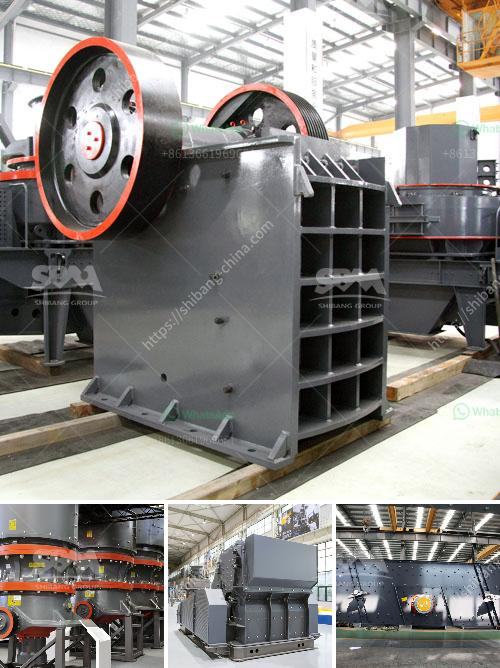

<h3>grinding machine for industrial use</h3>
In the world of manufacturing and production, accuracy, precision, and efficiency are of utmost importance. That's where grinding machines come into play. These powerful tools are designed to remove and shape materials to create finished products with exceptional detail and quality. With their immense capabilities, grinding machines have become a crucial component of various industries, revolutionizing the manufacturing process.

At the heart of grinding machines are abrasive wheels or belts that rotate at high speeds. As the workpiece is presented to the grinding surface, it is machined, removing any excess material, providing a smooth finish, and shaping the workpiece as desired. The precision and control offered by these machines are unmatched, ensuring the final product meets the strictest industry specifications.

One of the key advantages of using grinding machines in industrial settings is the ability to achieve high levels of accuracy and precision. These machines are engineered to tolerate minimal variations in measurements, ensuring the products' conformity to design specifications. This is particularly crucial in industries such as aerospace, automotive, medical devices, and tool manufacturing, where precision is non-negotiable.

Furthermore, grinding machines are incredibly versatile, capable of handling a wide range of materials. Whether it's metal, plastic, glass, ceramics, or composites, these machines can easily shape and refine the workpiece to meet the desired specifications. This adaptability allows manufacturers to produce a diverse range of products, catering to various industries' unique needs.

The efficiency of grinding machines also plays a pivotal role in industrial applications. By automating many grinding processes, these machines significantly reduce production time and labor costs. The advanced automation features allow for continuous operation, maximizing productivity and minimizing downtime. Manufacturers can rely on grinding machines to achieve high-volume production runs without compromising quality.

Another advantage of using grinding machines in industrial settings is the ability to improve surface finishes. From smoothing out rough edges to achieving mirror-like finishes, these machines are capable of transforming even the most challenging surfaces into a polished masterpiece. This opens up new opportunities for manufacturers, creating products with enhanced aesthetics and superior quality.

Moreover, grinding machines offer tremendous flexibility in terms of customization. Manufacturers can fine-tune the machine's parameters to match the specific requirements of the workpiece and achieve the desired results. With the ability to control various factors such as wheel speed, feed rate, and depth of cut, manufacturers have complete control over the grinding process, ultimately leading to optimal outcomes.

In conclusion, grinding machines have become an indispensable asset in the world of industrial manufacturing. Their ability to deliver high levels of accuracy, precision, and efficiency has revolutionized the production process across various industries. From shaping and refining workpieces to achieving superior surface finishes, these machines offer manufacturers the competitive edge needed to thrive in today's market. As technology continues to advance, we can expect grinding machines to play an even more significant role in shaping the future of industrial manufacturing.
<h3>Contact us</h3><ul><li><strong>Whatsapp:&nbsp;<a href="https://wa.me/8613661969651">+8613661969651</a></strong></li><li><a href="https://swt.shibang-china.com/?git&amp;zhl&amp;grinding machine for industrial use"><strong>Online Service(chat now)</strong></a></li></ul><h3>Related</h3><ul><li><a href='portable concrete crushers.md'>portable concrete crushers</a></li><li><a href='price of grinding mills in kenya.md'>price of grinding mills in kenya</a></li><li><a href='vsi crusher plant.md'>vsi crusher plant</a></li><li><a href='raymond mill plant.md'>raymond mill plant</a></li><li><a href='crusher for limestone.md'>crusher for limestone</a></li></ul>