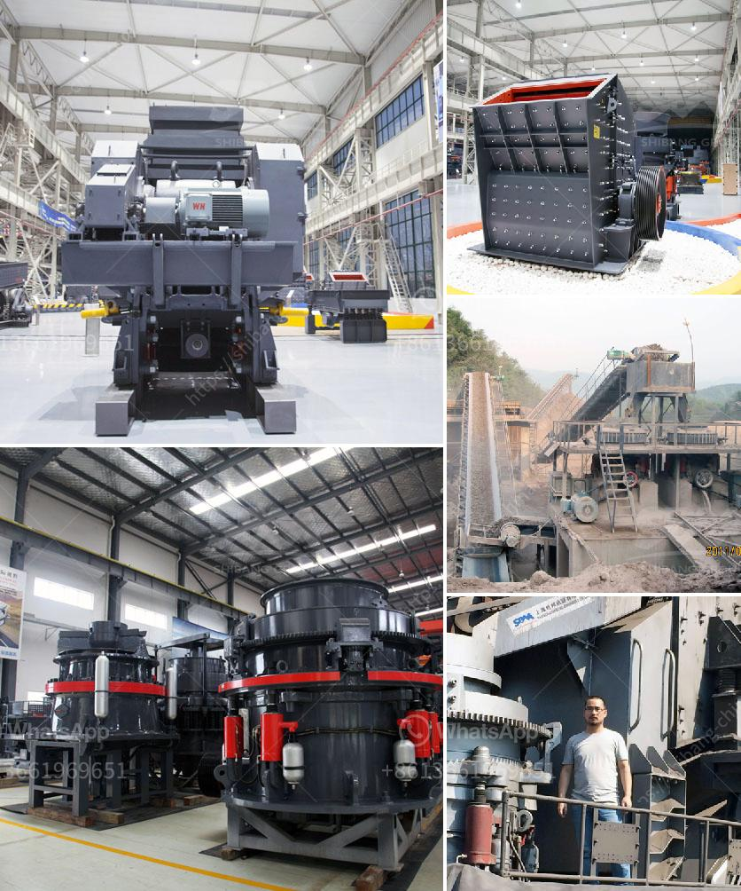

<h3>grinding mill barite</h3>
Barite, or baryte, is a white or colorless mineral commonly used in various industrial applications. It is known for its high specific gravity, which is due to its unique composition of barium sulfate. Barite can be found in sedimentary rocks, as well as veins and beds in various parts of the world. Its physical and chemical properties make it an essential component in many industries, leading to the widespread use of grinding mills to process this mineral.

The grinding mill barite is an essential piece of equipment for grinding barite minerals into fine powders used in various industries. Grinding mills can be used in wet or dry applications for grinding minerals, such as barite, limestone, ceramic, slag, and other ores. They are commonly used in the mining industry, where different types of mills, such as ball mills and vertical roller mills, are employed to crush and grind the minerals efficiently.

One of the primary purposes of grinding mill barite is to produce high-quality powders for oil drilling mud, which is an essential component in the oil and gas industry. The specific gravity of barite makes it an ideal material for controlling formation pressures and preventing blowouts during drilling operations. In the oil and gas industry, drilling mud acts as a lubricant and coolant, as well as carrying the drill cuttings to the surface. The barite powders produced by grinding mills are mixed with water to form drilling mud with specific densities, allowing it to meet the requirements of different drilling operations.

Another critical application of grinding mill barite is in the manufacturing of paint, rubber, and plastic products. Barite powders are used as fillers to enhance the physical properties of these products. For instance, in the paint industry, barite powders improve the viscosity, opacity, and chemical resistance of paints. In rubber and plastic products, they serve as reinforcing fillers, improving stiffness, abrasion resistance, and reducing shrinkage. Grinding mills provide the necessary fine grinding of barite, allowing manufacturers to produce consistent and high-quality powders that meet the requirements of various industries.

Moreover, grinding mill barite serves as a flux in the glass industry. Barite reduces the melting temperature of silica, thus facilitating the production of glass with a lower energy cost. Barite powders are also used in ceramic and pottery industries, where they act as a body and glaze constituent, improving the mechanical strength and durability of ceramic products.

With the increasing demand for minerals in various industries, the grinding mill barite has become an essential tool for efficiently producing fine powders. High-quality barite powders produced by grinding mills are used in a wide range of applications, including oil and gas drilling, paint manufacturing, rubber and plastic products, glassmaking, and ceramics. The continuous advancement in grinding mill technology enables manufacturers to produce consistent and high-quality powders, meeting the ever-growing requirements of different industries.

In conclusion, barite is a key industrial mineral with various applications. The grinding mill barite plays a crucial role in processing this mineral, transforming it into fine powders used in oil drilling mud, paint, rubber, plastic, glass, ceramics, and other industries. As the demand for barite continues to rise, the development of advanced grinding mill technologies will play an essential role in ensuring the efficient production of high-quality barite powders.
<h3>Contact us</h3><ul><li><strong>Whatsapp:&nbsp;<a href="https://wa.me/8613661969651">+8613661969651</a></strong></li><li><a href="https://swt.shibang-china.com/?git&amp;zhl&amp;grinding mill barite"><strong>Online Service(chat now)</strong></a></li></ul><h3>Related</h3><ul><li><a href='brick crusher line production.md'>brick crusher line production</a></li><li><a href='impact crusher design.md'>impact crusher design</a></li><li><a href='ceramic ball mill.md'>ceramic ball mill</a></li><li><a href='construction of jaw crusher.md'>construction of jaw crusher</a></li><li><a href='sample mining project proposal.md'>sample mining project proposal</a></li></ul>