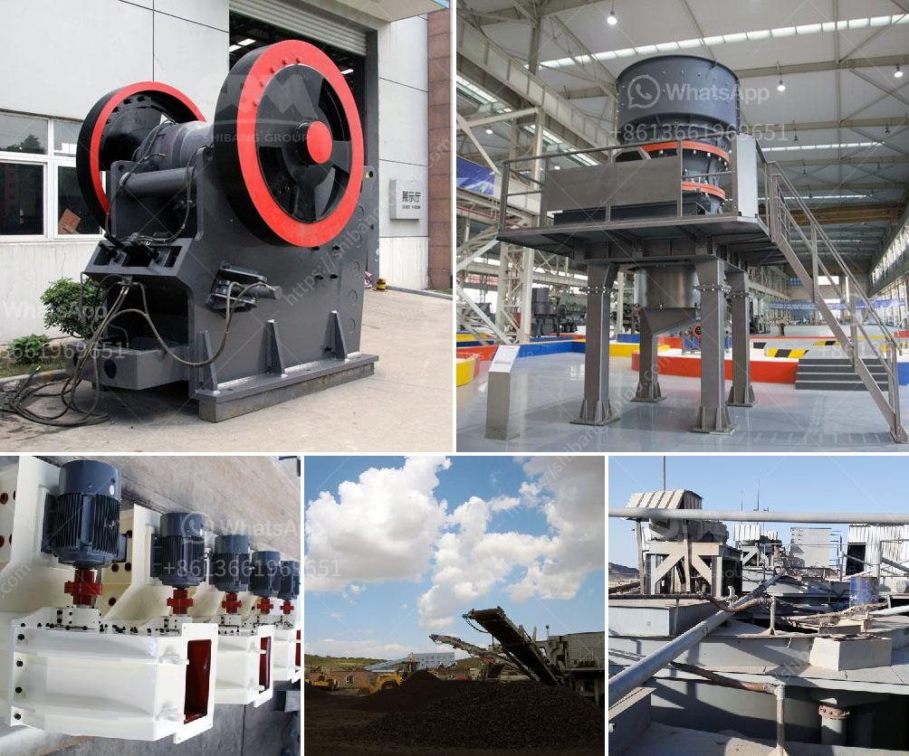

<h3>grinding mill cocoa powder plant duyvis</h3>
The cocoa bean is the main ingredient in the production of chocolate. However, before it can be turned into delicious treats, it goes through several processes, one of which is grinding. Grinding mills are essential equipment in cocoa powder plants, as they grind the cocoa beans into a powder form that can be easily mixed with other ingredients to create chocolate.

One of the leading manufacturers of grinding mills for cocoa powder plants is Duyvis. Duyvis has been producing high-quality grinding mills since the early 1900s. Their mills are known for their reliability, efficiency, and advanced grinding technology. These mills are designed to handle large quantities of cocoa beans, ensuring a consistent and uniform powder.

The grinding process in a cocoa powder plant involves a series of steps. First, the cocoa beans are roasted to bring out their rich flavors and aroma. This also helps to remove any excess moisture in the beans. Once roasted, the beans are fed into the grinding mill.

Duyvis grinding mills utilize a two-step grinding process. The first step involves crushing the cocoa beans into smaller pieces. This is done by passing the beans through a series of heavy-duty rollers that exert pressure on the beans, effectively breaking them into smaller particles. This step helps to release the cocoa butter, which is essential for the smooth texture of the chocolate.

The crushed cocoa beans are then fed into the mill's second grinding stage, where the particles are further refined into a fine powder. The grinding mill uses a combination of impact, compression, and shearing forces to break down the particles into smaller sizes. This ensures that the cocoa powder is of the desired fineness and texture.

Duyvis grinding mills are equipped with various features that enhance their efficiency and productivity. For instance, their mills are designed with advanced cooling systems to prevent overheating during the grinding process. This helps to maintain the quality of the cocoa powder and prevents any loss of flavor or nutritional value.

Furthermore, Duyvis grinding mills are equipped with PLC controls, which allow for precise control over the grinding process. This ensures that the cocoa powder is ground to the exact specifications required by the chocolate manufacturer. The mills also have adjustable settings, allowing for different levels of fineness depending on the specific requirements of the chocolate recipe.

In conclusion, grinding mills are a crucial component of cocoa powder plants, as they play a vital role in producing high-quality cocoa powder. Duyvis has established itself as a leading manufacturer of grinding mills, offering reliable and efficient equipment for the cocoa industry. Their mills are designed to handle large quantities of cocoa beans and produce a consistent and uniform powder. With advanced grinding technology and features, Duyvis grinding mills are trusted by chocolate manufacturers worldwide.
<h3>Contact us</h3><ul><li><strong>Whatsapp:&nbsp;<a href="https://wa.me/8613661969651">+8613661969651</a></strong></li><li><a href="https://swt.shibang-china.com/?git&amp;zhl&amp;grinding mill cocoa powder plant duyvis"><strong>Online Service(chat now)</strong></a></li></ul><h3>Related</h3><ul><li><a href='calcium carbonate plant contractors.md'>calcium carbonate plant contractors</a></li><li><a href='gypsum recycling machines for sale.md'>gypsum recycling machines for sale</a></li><li><a href='iron ore processing machine for sale.md'>iron ore processing machine for sale</a></li><li><a href='equipment used in iron ore beneficiation.md'>equipment used in iron ore beneficiation</a></li><li><a href='second hand sand mill in holland.md'>second hand sand mill in holland</a></li></ul>