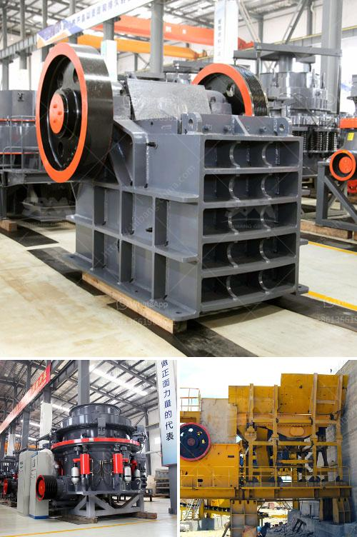

<h3>grinding mill for quartz in india</h3>
With numerous mineral resources, India is the fourth largest producer of quartz in the world. It accounts for about 12% of the world's total production of quartz. Being a mineral-rich country, there is a great demand for quartz for various industrial purposes. Quartz is used in different industries such as glass making, ceramics, and foundry molds, among others. Hence, grinding mills are crucial in India for quartz production.

India's quartz deposits occur in the form of several sedimentary quartz reefs and veins. The total resources estimated for quartz in India are 292 million tonnes, with Rajasthan and Andhra Pradesh accounting for around 85% of the total reserves. Quartz is mainly extracted from open-pit mining operations, which can lead to environmental issues and land degradation.

To efficiently extract and process quartz, the grinding mill is a critical piece of machinery used in the beneficiation and process plant. Grinding mills break down the mined ore, creating a fine powder to release the desired mineral components trapped in the quartz. Grinding mills are essential in industries like mining and cement production where ore needs to be crushed into finer particles to increase overall productivity and reduce downtime.

In India, grinding mills are primarily used for lignite and hard coal grinding into powder. These grinder machines have been utilized in coal-fired power plants, mining industry, and metallurgy sector to grind the crushed coal blocks into fine powder. Since the grinding mills are designed to break down large chunks of coal, grinding mills for quartz in India are considered to be a special type.

To successfully grind quartz, grinding mills need to be robust and able to withstand intense physical pressure. For quartz grinding, you can choose ball mill, vertical roller mill, super thin grinding mill and so on. Among these quartz grinding mills, our ultrafine mill will meet your requirements as it can produce fine powder of various ores. It is widely used in industries like metallurgy, construction, chemical industry, mining, highway construction, water conservancy, refractory materials industry, etc.

Quartz grinding mills have no rotating parts and thus require little maintenance. They also have a higher grinding efficiency than grinding wheels, which ensures higher revenue generation for the miners. Overall, India's quartz grinding mill is a good mid-range option for low-cost mining operations but it can also be the basis for further refinement if the need arises.

Since quartz is a non-renewable resource, it is essential to efficiently utilize the available resources. By employing the right technology and grinding mill, India can improve its quartz production and maximize its economic benefits. As a leading manufacturer and supplier of grinding mills in the global mining industry, our company can provide advanced machines for quartz powder production and ensure reliable performance and low maintenance cost. With the continuous development of mining industry, grinding mills are constantly evolving and improving to meet the increasing demands.

In conclusion, grinding mills are crucial equipment for grinding quartz in India. Improving the grinding efficiency of the mill can help quartz to meet economic benefits and conserve mineral resources, finally leading to greater profits for the mining industry.
<h3>Contact us</h3><ul><li><strong>Whatsapp:&nbsp;<a href="https://wa.me/8613661969651">+8613661969651</a></strong></li><li><a href="https://swt.shibang-china.com/?git&amp;zhl&amp;grinding mill for quartz in india"><strong>Online Service(chat now)</strong></a></li></ul><h3>Related</h3><ul><li><a href='crushers mobile crushers american mobile.md'>crushers mobile crushers american mobile</a></li><li><a href='calcium carbide making machine used.md'>calcium carbide making machine used</a></li><li><a href='small gold wash plant for sale in canada.md'>small gold wash plant for sale in canada</a></li><li><a href='diy stone crushing machine.md'>diy stone crushing machine</a></li><li><a href='hammer mill bolivia.md'>hammer mill bolivia</a></li></ul>