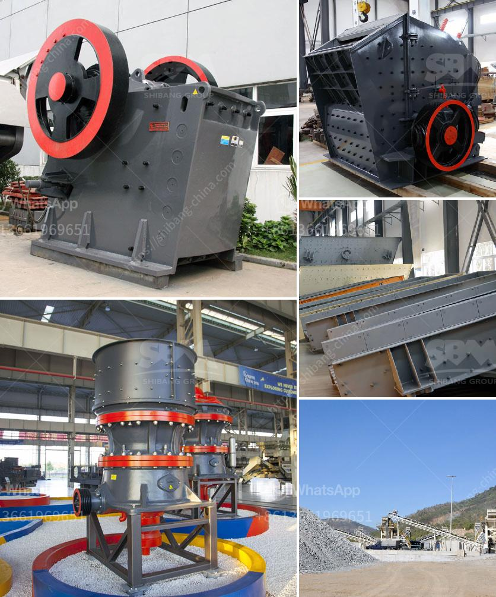

<h3>grinding mill grinding mill sale</h3>
In recent years, grinding mills have become an essential part of the manufacturing industry, transforming various materials into fine powder. The popularity of grinding mills is mainly due to their ability to grind materials efficiently and effectively. The market for grinding mills has witnessed significant growth, with many manufacturers offering a wide range of grinding mill options. Among these, grinding mill sale has emerged as a game changer, revolutionizing the world of grinding mills.

Grinding mill sale offers customers the opportunity to purchase high-quality grinding mills at discounted prices. This promotion has attracted the attention of many industries, including mining, construction, and chemical processing. The availability of a grinding mill sale has not only made it cost-effective for businesses but has also improved the overall productivity and efficiency of grinding operations.

One of the key advantages of a grinding mill sale is the variety of grinding mills available for purchase. Customers have access to a wide range of grinding mill types, including ball mills, vertical roller mills, and hammer mills, among others. Each grinding mill type caters to specific needs and requirements, allowing customers to choose a mill that best suits their application. This flexibility empowers businesses to optimize their grinding processes and achieve desired results.

Another significant benefit of a grinding mill sale is the access to advanced grinding technology. Many manufacturers participate in these sales to introduce their latest grinding mill models, offering cutting-edge features and improved performance. This enables businesses to stay at the forefront of technological advancements in grinding mills, enhancing their competitive edge in the market.

Grinding mill sale also provides an excellent opportunity for businesses to upgrade their current equipment. Often, established companies find it challenging to invest in new grinding mills due to budget constraints. However, through grinding mill sales, businesses can acquire state-of-the-art equipment at a fraction of the original cost, allowing them to enhance their operations without compromising their financial stability.

Moreover, the availability of grinding mill sales has democratized the process of purchasing grinding mills. Previously, only large corporations with significant budgets could acquire grinding mills. However, the introduction of grinding mill sales has made these essential machines accessible to smaller businesses and startups. This inclusivity has levelled the playing field, allowing every industry player to harness the benefits of grinding mills and compete on equal footing.

It is worth mentioning that customers should exercise caution when participating in grinding mill sales. While these promotions present excellent opportunities, it is essential to thoroughly research the manufacturers and their grinding mill offerings. By evaluating the reputation of the manufacturer and the specifications of the grinding mills on sale, customers can ensure the purchase of a reliable and high-quality product.

In conclusion, grinding mill sales have transformed the world of grinding mills, revolutionizing the manufacturing industry. Offering high-quality grinding mills at discounted prices, these sales have improved the efficiency and productivity of grinding operations. With a wide range of grinding mill types to choose from, advanced technology, and increased accessibility, grinding mill sales have become a game changer. Businesses can now optimize their grinding processes, stay at the cutting edge of technology, and upgrade their equipment within their budget constraints. However, customers must conduct thorough research to ensure a reliable purchase. Grinding mill sales have undoubtedly reshaped the grinding mill market and opened new avenues for businesses to achieve their production goals.
<h3>Contact us</h3><ul><li><strong>Whatsapp:&nbsp;<a href="https://wa.me/8613661969651">+8613661969651</a></strong></li><li><a href="https://swt.shibang-china.com/?git&amp;zhl&amp;grinding mill grinding mill sale"><strong>Online Service(chat now)</strong></a></li></ul><h3>Related</h3><ul><li><a href='granite crusher machine philippines.md'>granite crusher machine philippines</a></li><li><a href='ore processing plant for sale.md'>ore processing plant for sale</a></li><li><a href='stone crusher rotary screen in karnataka.md'>stone crusher rotary screen in karnataka</a></li><li><a href='sand vsi crusher.md'>sand vsi crusher</a></li><li><a href='manufacturer of slag roller crusher in philippines.md'>manufacturer of slag roller crusher in philippines</a></li></ul>