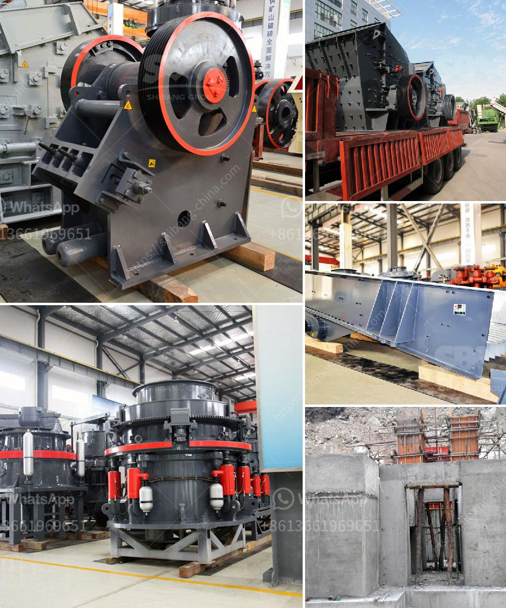

<h3>grinding mill machine kenya</h3>
Grinding mill machines have become essential pieces of equipment in the agricultural and industrial sectors. These machines efficiently and effectively grind various types of material into smaller, more manageable particles. In Kenya, the grinding mill machine industry has been experiencing a steady growth owing to the significant increase in demand for these machines.

One of the major factors driving the growth of this industry is the rising agricultural activities in Kenya. Agriculture plays a critical role in the country's economy, with a large number of small-scale farmers relying on grinding mill machines to process their crops. These machines are used to grind maize, wheat, beans, and other crops into flour or animal feed. The ground products are then used for consumption or sold in the market, generating income for the farmers.

Additionally, the industrial sector in Kenya has also contributed to the demand for grinding mill machines. Many industries, including food processing, pharmaceuticals, and construction, require fine powders or pastes for their manufacturing processes. Grinding mill machines provide a cost-effective solution for producing these powders or pastes on a large scale.

The increased demand for grinding mill machines in Kenya can be attributed to their numerous benefits. Firstly, these machines are efficient and time-saving. They can grind large quantities of material in a short period, reducing processing time and labor costs. Moreover, grinding mill machines are versatile and can be easily adjusted to achieve the desired particle size. This flexibility allows users to produce various product grades according to their specific requirements.

Furthermore, the grinding mill machine industry in Kenya has experienced technological advancements, making the machines more user-friendly and efficient. Many of the latest machines are equipped with automatic features, such as digital controls and sensors, which enhance their performance and productivity. These improvements have allowed even small-scale farmers and business owners to invest in grinding mill machines, further driving the growth of the industry.

Despite the positive outlook, the grinding mill machine industry in Kenya does face some challenges. One of the main obstacles is the high cost of these machines. Grinding mill machines are typically imported from other countries, which incurs additional expenses, including transportation and import duties. This makes the machines relatively expensive, especially for small-scale farmers and business owners. Therefore, efforts should be made to encourage local manufacturing and production of these machines, which would reduce costs and make them more accessible to all.

In conclusion, the grinding mill machine industry in Kenya is a promising sector that is steadily growing. The increasing demand from the agricultural and industrial sectors, coupled with the benefits and technological advancements of these machines, have contributed to this growth. However, cost remains a significant challenge that needs to be addressed to ensure the accessibility and affordability of grinding mill machines for all users. With the right strategies and support, the future of the grinding mill machine industry in Kenya looks bright, fueling economic growth and development in the country.
<h3>Contact us</h3><ul><li><strong>Whatsapp:&nbsp;<a href="https://wa.me/8613661969651">+8613661969651</a></strong></li><li><a href="https://swt.shibang-china.com/?git&amp;zhl&amp;grinding mill machine kenya"><strong>Online Service(chat now)</strong></a></li></ul><h3>Related</h3><ul><li><a href='quartz powder manufacturers manufacturers in china.md'>quartz powder manufacturers manufacturers in china</a></li><li><a href='grinding mill manufacturers.md'>grinding mill manufacturers</a></li><li><a href='crushers mobile crushers american mobile.md'>crushers mobile crushers american mobile</a></li><li><a href='accounting entry on crushing plant.md'>accounting entry on crushing plant</a></li><li><a href='roll crushers for sale.md'>roll crushers for sale</a></li></ul>