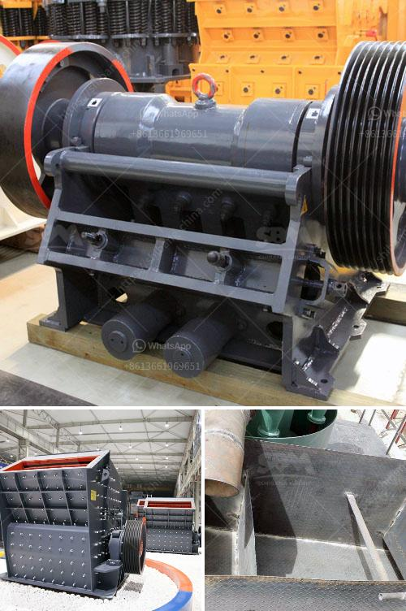

<h3>grinding mill machine</h3>
In today's fast-paced industrial world, grinding mill machines play a significant role in the production line. Grinding mills are designed to break solid material into smaller pieces, usually through the process of cutting, crushing, or grinding. Such comminution is essential for various industries, including mining, ceramics, metallurgy, and chemical plants, as it enables the production of finer particles and allows for easier handling and processing.

One of the most widely used types of grinding mill machines is a ball mill. This particular machine features a horizontal cylinder, which rotates on its axis, thereby causing a cascade motion of grinding balls to crush the material. Ball mills are commonly used for grinding materials such as cement, iron ore, and other minerals. They are also utilized in the construction industry for mixing materials for the production of concrete and other building materials.

Another popular type of grinding mill machine is a vertical roller mill. This mill is designed to grind a wide range of materials, including minerals, ores, and coal. It operates by utilizing a rotating table and rollers that apply pressure to the material, thereby grinding it into finer particles. Vertical roller mills are commonly used in the cement industry, where they are known for their energy efficiency and ability to produce cement with higher strengths.

Grinding mill machines are equipped with various components and systems that ensure their smooth operation and high performance. These include a motor, transmission device, grinding rollers, grinding disc, and control system. The control system is particularly vital as it regulates the entire grinding process, including controlling the speed of the mill and the amount of material being fed into it. Advanced control systems also allow operators to monitor and adjust various parameters, such as temperature and fineness of the product.

Using grinding mill machines reduces manual labor and enhances overall efficiency in industrial grinding processes. With their ability to generate finer particles and handle various materials, these machines contribute to improved product quality and reduced production costs. Furthermore, their operation can be automated, allowing for continuous processing and minimizing downtime.

In conclusion, grinding mill machines are essential tools for industrial grinding operations. Whether it is for cement production, ore processing, or any other application, these machines offer efficient and cost-effective solutions. With advancements in technology, grinding mill machines continue to evolve, incorporating new features and control systems to further enhance their performance. As industries strive for higher productivity and sustainability, grinding mill machines will remain a critical component in the manufacturing process.
<h3>Contact us</h3><ul><li><strong>Whatsapp:&nbsp;<a href="https://wa.me/8613661969651">+8613661969651</a></strong></li><li><a href="https://swt.shibang-china.com/?git&amp;zhl&amp;grinding mill machine"><strong>Online Service(chat now)</strong></a></li></ul><h3>Related</h3><ul><li><a href='cone crusher for hire south africa.md'>cone crusher for hire south africa</a></li><li><a href='conventional hammer mill.md'>conventional hammer mill</a></li><li><a href='crusher machine on lease in hyderabad.md'>crusher machine on lease in hyderabad</a></li><li><a href='list of gold mining company in zimbabwe.md'>list of gold mining company in zimbabwe</a></li><li><a href='coal mining process machinery.md'>coal mining process machinery</a></li></ul>