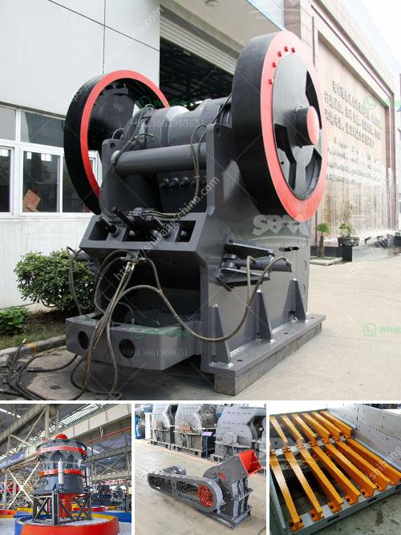

<h3>grinding mill manufacturer in italy</h3>
Italy is renowned for its rich cultural heritage, picturesque landscapes, and mouthwatering cuisine. However, it is not just limited to these aspects; the country is also home to some of the world's leading manufacturers of grinding mills. These mills play a crucial role in various industries, including mining, construction, and energy production.

One such prominent grinding mill manufacturer in Italy is Furlanetto S.p.A. Established in 1926, this family-owned company has been consistently delivering high-quality grinding mills for both domestic and international customers. With a strong focus on research and development, Furlanetto S.p.A has been able to incorporate cutting-edge technology into their products, ensuring superior performance and efficiency.

The grinding mills manufactured by Furlanetto S.p.A are known for their reliability, durability, and precision. With a wide range of models available, they cater to the diverse needs of their customers. Whether it's a small-scale operation or a large industrial plant, Furlanetto S.p.A has the perfect grinding mill solution for every requirement.

One of the key features that sets Furlanetto S.p.A apart from its competitors is its commitment to sustainability. The company places great emphasis on environmental stewardship, ensuring that their manufacturing processes have minimal impact on the ecosystem. By incorporating energy-efficient technologies, Furlanetto S.p.A's grinding mills contribute to reducing carbon emissions and conserving natural resources.

In addition to their exceptional product quality, Furlanetto S.p.A also prioritizes customer satisfaction. The company has a dedicated team of experts who provide personalized support and guidance to clients, from the initial consultation stage to the after-sales service. This level of customer care has earned Furlanetto S.p.A a loyal customer base, both in Italy and abroad.

Another well-known grinding mill manufacturer in Italy is Gebr. Pfeiffer. Founded in 1864, Gebr. Pfeiffer has been a leading name in the industry for over a century. Specializing in vertical roller mills, they have successfully supplied their mills to customers across the globe.

Gebr. Pfeiffer prides itself on constantly innovating and improving its products to meet the evolving demands of the market. The company's mills are designed to deliver exceptional performance, high efficiency, and low maintenance costs. This commitment to excellence has made Gebr. Pfeiffer a trusted supplier for industries such as cement, power generation, and mining.

Italy's grinding mill manufacturers have undoubtedly made a significant impact on the global industrial landscape. Their relentless pursuit of innovation, commitment to sustainability, and dedication to customer satisfaction have cemented their reputation as leaders in the field. With their technologically advanced and environmentally friendly solutions, these manufacturers are poised to play a significant role in shaping the future of the grinding mill industry. Whether it's providing efficient solutions for mineral processing or contributing to renewable energy production, these Italian manufacturers continue to push boundaries, setting new benchmarks for the industry worldwide.
<h3>Contact us</h3><ul><li><strong>Whatsapp:&nbsp;<a href="https://wa.me/8613661969651">+8613661969651</a></strong></li><li><a href="https://swt.shibang-china.com/?git&amp;zhl&amp;grinding mill manufacturer in italy"><strong>Online Service(chat now)</strong></a></li></ul><h3>Related</h3><ul><li><a href='price for sand machine.md'>price for sand machine</a></li><li><a href='granite stone crusher india.md'>granite stone crusher india</a></li><li><a href='jaw crusher plant 20 tph.md'>jaw crusher plant 20 tph</a></li><li><a href='hand crank oyster shell crusher.md'>hand crank oyster shell crusher</a></li><li><a href='equipment used in quarry crusher.md'>equipment used in quarry crusher</a></li></ul>